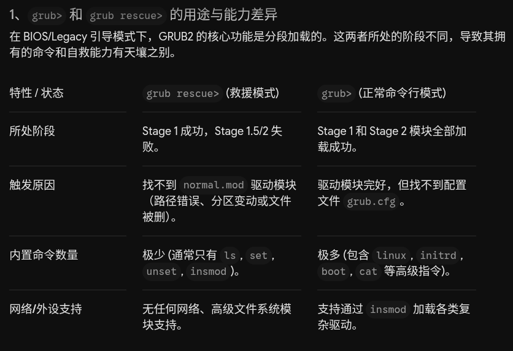

[toc]


# Rocky/Alma/CentOS7-9仅恢复grub

<font color=red>**当/boot/目录中为空时只能通过iso镜像进入Rescue模式来恢复，不要浪费时间**</font>

## 在rocky9上



```
两者各能做什么？
grub rescue> 能做什么：
查看分区：使用 ls 列出所有被 MBR 识别到的物理分区(如(hd0,msdos1))
修改指针：使用 set root=... 和 set prefix=... 重新指定 GRUB 应该去哪里寻找它的驱动模块
尝试加载核心：如果驱动文件还在，可以通过 insmod normal 强行加载基本内核命令
它不能做：无法直接加载 Linux 内核。 因为它不认识 linux 或 linuxefi 命令，不跨过这个阶段就绝对无法引导系统

grub> 能做什么：
盲测并手动引导系统：它是全功能的shell。你可用 ls (hd0,1)/ 查看文件列表，使用linux /vmlinuz-... 和 initrd /initramfs-... 直接手动把内核塞进内存，最后用 boot 拔开软盘直接启动系统
诊断硬件与查看文件：可用cat命令直接读取系统盘内的文本文件(如/etc/fstab)，排查是否因为分区UUID改动导致挂载失败

```


## 解决强行互锁重装

### 故障复现

```
模拟网络中断下的rpm级修复：切断虚拟机网络，模拟 grub2-efi 或 shim 核心组件爆红损坏，练习直接通过本地ISO盘强行互锁重装

客户的服务器在断网或无法解析dns时，核心引导组件(grub2-efi, shim)损坏。此时无法使用dnf/yum在线下载，且这两个组件存在强烈的互锁依赖(互相校验版本)。如直接单独装某一个，系统会报依赖错误拒绝执行

# 模拟组件彻底损坏（强行卸载核心引导包）
在正常情况下，如果你执行 dnf remove grub2-efi，系统会提示你这会连带卸载 kernel，拒绝执行。我们必须用 rpm 的底层暴力手段，只清除记录，不碰内核：
# 强行在 RPM 数据库中抹去 grub2-efi 和 shim 的安装记录，模拟它们被彻底损坏/污染

# ================== UEFI模式 ===================
rpm -e --nodeps grub2-efi-x64 shim-x64 grub2-tools
3. 顺手干掉 EFI 存根（制造真正的无法启动故障）
rm -rf /boot/efi/EFI/rocky/*
# ===============================================

[root@rocky9 ~]# rpm -e --nodeps grub2-pc grub2-pc-modules grub2-tools
[root@rocky9 ~]# rm -rf /boot/grub2/i386-pc/*
此时重启将100%陷入 grub rescue> 且由于没有.mod文件，insmod normal会无限报错，彻底瘫痪

```

### dnf解决失败

```shell
以下是完全不依赖网络、纯靠本地光盘镜像进行rpm级强行重装的真实生产方案：
# 挂载本地光盘并切入 Rescue 环境
1、给虚拟机断开网络，挂载 Rocky Linux 9 的官方 DVD ISO
2、调整 BIOS/UEFI 引导顺序，从光盘启动，选择 Troubleshooting -> Rescue a Rocky Linux system -> 输入 1 (Continue) 自动挂载磁盘
3、进入救援 Shell (sh-5.1#)

# 绑定并挂载光盘镜像到真实系统中
由于你在chroot切换环境后，默认是无法访问光盘文件的。必须在chroot之前把光盘的物理路径映射到原系统的挂载点中：
# 1. 确认原系统的根目录已经挂载在/mnt/sysimage
# 2. 确认光盘在救援环境下的设备名(通常是 /dev/cdrom 或 /dev/sr0)
# 3. 在原系统中创建一个临时目录用于挂载光盘
mkdir -p /mnt/sysroot/mnt/usb1
mount -o ro /dev/sr0  /mnt/sysroot/mnt/usb1
systemctl daemon-reload
mount -o ro /dev/sr0  /mnt/sysroot/mnt/usb1


# 切入真实的 chroot 环境
chroot /mnt/sysroot
此时你进入了客户损坏的真实系统，且通过/mnt/iso路径可以直接离线访问光盘内的所有原始rpm包

# 利用本地仓库执行 RPM 强行互锁重装
如果你直接去 cd /mnt/usb1/BaseOS/Packages/ 里面单独执行 rpm -ivh grub2-efi...，系统会提示缺少shim依赖；反之亦然。这就是互锁损坏

为了打破互锁，必须利用dnf本地仓库机制让它自己解开依赖，或者用rpm联合安装

方法A：配置临时本地dnf源(最推荐，不易漏掉次生依赖)
禁用所有联网的repo：
mkdir /etc/yum.repos.d/bak
mv /etc/yum.repos.d/*.repo  /etc/yum.repos.d/bak/

vim /etc/yum.repos.d/local.repo        # 建立本地离线repo文件
[local-baseos]
name=Local BaseOS
baseurl=file:///mnt/usb1/BaseOS
enabled=1
gpgcheck=0

[local-appstream]
name=Local appstream
baseurl=file:///mnt/usb1/AppStream
enabled=1
gpgcheck=0

清理缓存并强行重装：
dnf clean all

EFI格式: dnf install -y grub2-efi grub2-efi-x64 shim-x64 grub2-tools
BIOS格式: dnf install -y grub2-pc grub2-pc-modules grub2-tools
先检查这几个包有无安装，如未安装则用install,如提示已安装则用reinstall

dnf reinstall 会在本地 BaseOS 仓库中同时抓取这两个组件，在内存中统一计算依赖并同时覆盖写入，完美解决互锁问题
```

### 用rpm命令安装


```
方法B：RPM联合命令强行覆盖(适合dnf损坏的极端状况)
如果连dnf命令本身都爆红无法使用了，直接肉眼定位到rpm包目录：
cd /mnt/usb1/BaseOS/Packages/g/
# 找到 grub2-efi 和 grub2-tools 的具体包名
cd /mnt/usb1/BaseOS/Packages/s/
# 找到shim的具体包名
将这几个由于依赖互相锁死的包写在同一行命令里，并加入 --force（强制覆盖）和 --nodeps（忽略依赖检查）参数强行灌入系统：
bash-5.1# pwd
/mnt/usb1/BaseOS/Packages

EFI格式：
rpm -ivh --force --nodeps ./g/grub2-efi-x64-*.rpm  ./g/grub2-tools-*.rpm  ./s/shim-x64-*.rpm

BIOS格式：
rpm -ivh --force --nodeps ./g/grub2-pc-2.06-*.x86_64.rpm \
./g/grub2-tools-2.06-*.x86_64.rpm \
./g/grub2-pc-modules-2.06-*.noarch.rpm \
./s/shim-x64-*


# 物理触发 grub2-install
只装rpm包只是把文件放到了系统的硬盘里，在BIOS模式下，必须使用下面的物理指令强行将这些 .mod 文件提取并刷入磁盘的引导扇区(假设第一块系统盘是/dev/nvme0n1，请通过lsblk确认)
bash-5.1# grub2-install /dev/nvme0n1

# 原地验证
bash-5.1# ls -l /boot/grub2/i386-pc/normal.mod
注：
如果看到了 normal.mod 文件，说明底层驱动已经彻底起死回生
如果还是空的，说明上面的 grub2-install 报错了，请仔细查看其输出


# 刷新EFI引导链并固化配置
组件灌回硬盘后，必须重新刷出启动项(针对UEFI模式)：
# 重新生成 Rocky Linux 9 的 EFI 启动链
grub2-mkconfig -o /boot/grub2/grub.cfg

# 如果是UEFI模式，确保EFI目录下的存根完好
ls -l /boot/efi/EFI/rocky/

# 还原环境并重启
把之前移走的联网 repo 恢复原位：
mv /etc/yum.repos.d/bak/*.repo /etc/yum.repos.d/
rmdir /etc/yum.repos.d/bak

干净退出：
exit
sync
poweroff          # 修改成硬盘为第一启动项


# 完美解决

````


# Rocky/Alma/CentOS7-9整体删除/boot/grub/*恢复

```shell
三者的GRUB修复思路基本一致:

启动救援环境
↓
挂载系统分区
↓
chroot
↓
重新安装GRUB
↓
重新生成配置
↓
重启验证


但是: CentOS 7 ≠ Rocky Linux 8 ≠ Rocky Linux 9


主要区别体现在:
* BIOS与UEFI启动方式
* grub.cfg生成位置
* EFI目录结构
* dracut与内核镜像关系
* Boot Loader Spec(BLS)

因此实际接单时不能照抄命令.

```

---

## 一、系统差异总览

| 项目         | CentOS 7 | Alma/Rocky 8 | Alma/Rocky 9 |
| ------------ | -------- | ------------ | ------------ |
| Kernel       | 3.10     | 4.18         | 5.14         |
| GRUB版本     | grub2    | grub2        | grub2        |
| 默认启动方式 | BIOS较多 | UEFI较多     | UEFI几乎主流 |
| BLS支持      | 否       | 默认开启     | 默认开启     |
| dracut       | 较旧     | 新版         | 更新版       |
| Secure Boot  | 较少     | 常见         | 普遍         |

---

## 二、CentOS 7修复方式

#### BIOS格式异常启动
```bash
故意破坏MBR:
[root@centos7 ~]# dd if=/dev/zero of=/dev/sda bs=512 count=1
或
[root@centos7 ~]# rm -rf /boot/grub2/*
[root@centos7 ~]# reboot

释义：
rm -rf  /boot/*  和  /boot/grub2/*

这两个完全不是一个级别. 

情况1、如果只是:
rm -rf /boot/grub2/*

那么:
Kernel还在.
initramfs还在.

只需要:
grub2-mkconfig -o /boot/grub2/grub.cfg

甚至可能不用重装GRUB.

```


```
# 解决
进入Rescue Mode
```


> 如果目标是修复系统而不是取证分析


```
这不是 /boot 全部被删除, 而是 /boot/grub2 基本被清空了.

因为/boot下面仍然存在:
vmlinuz-3.10.0-1160.119.1.el7.x86_64
initramfs-3.10.0-1160.119.1.el7.x86_64.img
efi/

说明:
Kernel 存在
Initramfs 存在
EFI分区存在

系统主体没坏. 如果按生产环境划分:
★★★★★ 磁盘损坏
★★★★☆ 文件系统损坏
★★★☆☆ LVM损坏
★★☆☆☆ initramfs损坏
★☆☆☆☆ grub配置丢失          # 当前属于的情况


先确认启动模式
ls /sys/firmware/efi
如果看到 efivars 则说明是UEFI启动
如果提示 No such file or directory 则说明是Legacy BIOS启动
该步骤非常重要, 因为后面命令不同

# 如果是BIOS模式,则：
grub2-install /dev/sda           # 假设系统盘是sda.
grub2-mkconfig -o /boot/grub2/grub.cfg
ls -l /boot/grub2
正常应该出现:
grub.cfg
i386-pc
fonts
locale

然后:
exit
reboot


# 如果是UEFI模式，则:
ls /boot/efi/EFI
一般CentOS7可能是:
centos
BOOT

或者:
redhat
BOOT

然后执行:
grub2-install

再执行:
grub2-mkconfig -o /boot/grub2/grub.cfg

最后:
efibootmgr -v

确认EFI启动项还在.


```


```
退出:
exit
reboot 或 关机把第一启动项设置为从硬盘启动

```


```shell
情况2、如果是:
rm -rf /boot/*

那么:
vmlinuz没了
initramfs没了
grub.cfg没了

这时候不仅仅是GRUB问题.
需要重建整个boot.

```


```
如果是情况2
进入:
1) Continue

chroot /mnt/sysimage

先看:
rpm -qa | grep kernel
比如内核还在，说明RPM数据库没坏:
kernel-3.10.0-1160.el7.x86_64

重新安装Kernel包:
yum reinstall kernel kernel-tools kernel-core
```


```shell
如果DVD作为源:
yum --disablerepo="*" --enablerepo=c7-media  -y reinstall kernel*
```


```shell
重建initramfs:dracut -f

# 重建GRUB
BIOS:
grub2-install /dev/sda
grub2-mkconfig -o /boot/grub2/grub.cfg

# ===================================
UEFI:
先确认:
ls /boot/efi/EFI

然后:
grub2-install
grub2-mkconfig -o /boot/grub2/grub.cfg
# ===================================


exit
poweroff        # 然后把第一启动项改成从硬盘启动


如果 grub2-install 报错
比较常见的是:
/usr/lib/grub/i386-pc/modinfo.sh doesn't exist
或者:
grub2-install: error: cannot find a device for /boot

有以上情况则说明以下情况，需要先修RPM包:
grub2-pc包损坏
grub2组件缺失
boot挂载异常


# CentOS 7 DVD进入Rescue后
1) Continue
2) Read-only mount
3) Skip to shell
4) Quit


Continue  自动寻找Linux系统.
通常会看到:
The rescue environment will now attempt to find your Linux installation and mount it under the directory /mnt/sysimage.
然后:
Your system has been mounted under /mnt/sysimage.
此时系统已经帮你完成:

mount /dev/sdaX /mnt/sysimage

后续直接:
chroot /mnt/sysimage

即可开始修复，这是官方推荐方式.


Read-Only Mount  会把系统挂载成只读
例如:
mount -o ro
此时:
grub2-install

可能失败.因为需要写入以下等位置所以不适合GRUB修复，一般用于:数据抢救、取证、查看配置:
/boot
/boot/grub2
MBR
EFI


Skip To Shell   直接给你一个救援Shell.
不会自动挂载系统，需要自己挂载, 普通GRUB修复没必要选:
fdisk -l                  # 找分区
mount /dev/sda2 /mnt      # 自己挂
适用于:
自动挂载失败
LVM异常
RAID异常


Quit
直接重启, 当然没意义

```


#### UEFI格式异常启动
```bash
[root@c7efi ~]# ls /boot/
config-3.10.0-1160.119.1.el7.x86_64                      initramfs-3.10.0-1160.el7.x86_64kdump.img
config-3.10.0-1160.el7.x86_64                            symvers-3.10.0-1160.119.1.el7.x86_64.gz
efi                                                      symvers-3.10.0-1160.el7.x86_64.gz
grub                                                     System.map-3.10.0-1160.119.1.el7.x86_64
grub2                                                    System.map-3.10.0-1160.el7.x86_64
initramfs-0-rescue-99a4ab99d0b744bd89939d1385353d46.img  vmlinuz-0-rescue-99a4ab99d0b744bd89939d1385353d46
initramfs-3.10.0-1160.119.1.el7.x86_64.img               vmlinuz-3.10.0-1160.119.1.el7.x86_64
initramfs-3.10.0-1160.119.1.el7.x86_64kdump.img          vmlinuz-3.10.0-1160.el7.x86_64
initramfs-3.10.0-1160.el7.x86_64.img
[root@c7efi ~]# ls /boot/grub2/
grubenv
[root@c7efi ~]# ls /boot/grub2
grubenv
[root@c7efi ~]# ls /boot/grub
splash.xpm.gz
[root@c7efi ~]# ls /boot/efi/
EFI
[root@c7efi ~]# ls /boot/efi/EFI/
BOOT  centos
[root@c7efi ~]# df -Th
文件系统                类型      容量  已用  可用 已用% 挂载点
devtmpfs                devtmpfs  1.9G     0  1.9G    0% /dev
tmpfs                   tmpfs     1.9G     0  1.9G    0% /dev/shm
tmpfs                   tmpfs     1.9G   12M  1.9G    1% /run
tmpfs                   tmpfs     1.9G     0  1.9G    0% /sys/fs/cgroup
/dev/mapper/centos-root xfs        37G  1.8G   36G    5% /
/dev/sda2               xfs      1014M  187M  828M   19% /boot
/dev/sda1               vfat      200M   12M  189M    6% /boot/efi
/dev/mapper/centos-home xfs        19G   33M   18G    1% /home
tmpfs                   tmpfs     378M     0  378M    0% /run/user/0
[root@c7efi ~]# lsblk 
NAME            MAJ:MIN RM  SIZE RO TYPE MOUNTPOINT
sda               8:0    0   60G  0 disk 
├─sda1            8:1    0  200M  0 part /boot/efi
├─sda2            8:2    0    1G  0 part /boot
└─sda3            8:3    0 58.8G  0 part 
  ├─centos-root 253:0    0 36.9G  0 lvm  /
  ├─centos-swap 253:1    0  3.9G  0 lvm  [SWAP]
  └─centos-home 253:2    0   18G  0 lvm  /home
sr0              11:0    1  4.4G  0 rom  


# 终极大招
[root@c7efi ~]# rm -rf /boot/*
rm: 无法删除"/boot/efi": 设备或资源忙
[root@c7efi ~]# ls /boot/
efi


# CentOS 7 DVD进入Rescue后

第一阶段：挂载环境(在chroot之前搞定光盘)
# 1. 激活并挂载系统根分区
lvm vgchange -ay
mount /dev/mapper/centos-root /mnt/sysimage/

# 2. 建立光盘挂载点，必须在 /mnt/sysimage 内部
mkdir -p /mnt/sysimage/mnt/usb1

# 3. 挂载物理设备：先挂载Boot分区，再挂载光盘，最后挂载EFI(这一部分可以已正常挂载了)
mount /dev/sda2 /mnt/sysimage/boot
mount /dev/sr0 /mnt/sysimage/mnt/usb1          # 假设 /dev/sr0 是你的本地光盘
mount /dev/sda1 /mnt/sysimage/boot/efi 

# 4. 绑定系统虚拟文件系统
mount -o bind /dev /mnt/sysimage/dev
mount -o bind /proc /mnt/sysimage/proc
mount -o bind /sys /mnt/sysimage/sys

# 5. 正式进入 chroot
chroot /mnt/sysimage/

第二阶段：在 chroot 环境内恢复内核与配置
# 1. 此时在 chroot 内部，光盘路径在 /mnt/usb1
cd /mnt/usb1/Packages/

# 2. 强制覆盖安装内核（不需要配置 YUM，直接用 rpm 效率最高）
rpm -ivh --force kernel-3.10.0-*.rpm

# 3. 必须验证内核文件是否存在
ls /boot/
# 确认看到 vmlinuz-3.10.0-xxxx 和 initramfs-3.10.0-xxxx.img 

# 重装UEFI引导文件(解决 No compatible bootloader found)
# 不要使用单纯的 grub2-install，直接用 rpm 重新把 EFI 引导链补全
rpm -ivh --force grub2-*.rpm  shim-x64-*.rpm

# 4. 恢复 GRUB2 引导配置
mkdir -p /boot/grub2
grub2-editenv /boot/grub2/grubenv create
mkdir -p /boot/efi/EFI/centos/
grub2-mkconfig -o /boot/efi/EFI/centos/grub.cfg
注意：执行完最后一步，命令行必须输出 Found linux image... 且没有报错才算成功

# 5. 退出 chroot
exit

第三阶段：干净卸载（彻底断绝 reboot 爆红）
注意：退出来之后，当前的 Shell 路径绝对不能处于 /mnt/sysimage 及其子目录下！先切回安全路径：
cd /

# 严格按照由深到浅的顺序卸载，不要无故加 -l 参数
umount  /mnt/sysimage/boot/efi
umount  /mnt/sysimage/mnt/usb1        # 干净卸载光盘
umount  /mnt/sysimage/boot

umount  /mnt/sysimage/dev
umount  /mnt/sysimage/proc
umount  /mnt/sysimage/sys

# 最后才能卸载根目录本身
umount /mnt/sysimage

# 数据落盘，安全重启
sync
reboot   # 或poweroff关机，把光盘设置成第一启动项后再开机

```


---

## 三、Rocky8修复方式

#### BIOS格式异常启动
```bash
[root@c8 ~]# rm -rf  /boot/*
[root@c8 ~]# reboot

```


```
流程基本相同:
grub2-install /dev/nvme0n1        # grub2-install 永远安装到磁盘, 不是安装到分区

然后:
grub2-mkconfig -o /boot/grub2/grub.cfg

exit
poweroff               # 更换第一启动项

```


---

#### UEFI格式异常启动
```shell
[root@rocky8efi ~]# lsblk -f
NAME        FSTYPE      LABEL                UUID                                   MOUNTPOINT
sda                                                                                 
|-sda1      vfat                             F8C6-E325                              /boot/efi
|-sda2      LVM2_member                      WEdDEt-LvP2-eDod-K3Rb-GB1o-upfn-o1sAJY 
| |-rl-root xfs                              585450b3-bd50-4d76-8a79-060737705398   /
| `-rl-swap swap                             32fa2921-eb5d-49b3-8fb2-6e3122d0e244   [SWAP]
`-sda3      ext4                             488b8278-5586-4206-b133-a7ba72fd63a8   /boot
sr0         iso9660     Rocky-8-5-x86_64-dvd 2021-11-14-09-31-13-00  

[root@rocky8efi ~]# df -Th | grep "^/dev"
/dev/mapper/rl-root xfs        54G  3.4G   51G   7% /
/dev/sda3           ext4      1.5G  240M  1.1G  18% /boot
/dev/sda1           vfat      599M  5.9M  594M   1% /boot/efi


[root@rocky8efi ~]# ls /boot/
System.map-4.18.0-348.el8.0.2.x86_64                     initramfs-4.18.0-553.126.1.el8_10.x86_64.img
System.map-4.18.0-553.126.1.el8_10.x86_64                initramfs-4.18.0-553.126.1.el8_10.x86_64kdump.img
config-4.18.0-348.el8.0.2.x86_64                         loader
config-4.18.0-553.126.1.el8_10.x86_64                    lost+found
efi                                                      symvers-4.18.0-348.el8.0.2.x86_64.gz
grub2                                                    symvers-4.18.0-553.126.1.el8_10.x86_64.gz
initramfs-0-rescue-31029e4369074aeaae78595f092bdd19.img  vmlinuz-0-rescue-31029e4369074aeaae78595f092bdd19
initramfs-4.18.0-348.el8.0.2.x86_64.img                  vmlinuz-4.18.0-348.el8.0.2.x86_64
initramfs-4.18.0-348.el8.0.2.x86_64kdump.img             vmlinuz-4.18.0-553.126.1.el8_10.x86_64
[root@rocky8efi ~]# ls /boot/grub2/
grubenv
[root@rocky8efi ~]# ls /boot/efi/
EFI
[root@rocky8efi ~]# ls /boot/efi/EFI/
BOOT  rocky
[root@rocky8efi ~]# ls /boot/efi/EFI/rocky/
BOOTX64.CSV  fonts  grub.cfg  grubenv  grubx64.efi  mmx64.efi  shimx64-rocky.efi  shimx64.efi


[root@rocky8efi ~]# rm -rf /boot/*


Rocky8进入Rescue恢复流程
选择1 continue


激活LVM:
vgchange -ay

# 查看分区
lsblk -f


挂载:
mount /dev/mapper/rl-root  /mnt
mount /dev/sda2  /mnt/boot
mount /dev/sda1  /mnt/boot/efi

chroot:
mount --bind /dev /mnt/dev
mount --bind /proc /mnt/proc
mount --bind /sys /mnt/sys

chroot /mnt
```

```shell
重装内核
dnf -y reinstall kernel-*

如果仓库不可用:
/etc/yum.repos.d/中只剩下本地的repo文件
mount /dev/sr0 /mnt/usb1
rpm -ivh /mnt/cdrom/BaseOS/Packages/kernel-*


Rocky8重建initramfs
dracut -f


重建grub
mkdir -p /boot/grub2                           # 创建目录
grub2-editenv /boot/grub2/grubenv create       # 创建环境文件
grub2-mkconfig -o /boot/grub2/grub.cfg         # 生成配置


UEFI机器需再同步EFI配置:
mkdir /boot/efi/EFI/rocky/
grub2-mkconfig -o /boot/efi/EFI/rocky/grub.cfg

如果EFI文件也丢失
ls /boot/efi/EFI/rocky           # 现在该目录下只有grub.cfg，因为所有都丢失了

如果以下2个文件也丢失:
grubx64.efi
shimx64.efi

安装:
cd /mnt/usb1/BaseOS/Packages
rpm -ivh --nodeps --force  g/grub2-*
rpm -ivh --nodeps --force  shim-x64-*


先检查 EFI 文件是否存在:
ls -R /boot/efi/EFI/rocky/        # 重点看该项
shimx64.efi
grubx64.efi
grub.cfg
如果EFI文件还在则通常只需要:
grub2-editenv /boot/grub2/grubenv create

grub2-mkconfig -o /boot/grub2/grub.cfg

然后:
cp -a /boot/grub2/grub.cfg  /boot/efi/EFI/rocky/grub.cfg
或者:
grub2-mkconfig -o /boot/efi/EFI/rocky/grub.cfg

# =========================================
如果EFI文件没了
不要执行grub2-install

而是:
dnf reinstall shim-x64 grub2-efi-x64 grub2-efi-x64-modules

安装包会自动恢复:
shimx64.efi
grubx64.efi

然后:
grub2-mkconfig -o /boot/grub2/grub.cfg
# =========================================


再检查NVRAM
efibootmgr -v

正常应该有类似:
Boot0000* Rocky

如果没有:
efibootmgr \
-c \
-d /dev/sda \
-p 1 \
-L Rocky \
-l '\EFI\rocky\shimx64.efi'


不过在重启前, 我建议做最后三个检查:
ls -l /mnt/boot

确认以下文件已经存在:
vmlinuz-*
initramfs-*


ls -l /mnt/boot/efi/EFI/rocky
确认以下文件存在:
shimx64.efi
grubx64.efi
grub.cfg


确认配置文件不是空文件
cat /mnt/boot/efi/EFI/rocky/grub.cfg | head
或者:
cat /mnt/boot/grub2/grub.cfg | head


退出chroot
然后卸载绑定挂载:
umount /mnt/dev
umount /mnt/proc
umount /mnt/sys       # 有可能需要加-l

再卸载 EFI 和 boot:
umount /mnt/boot/efi
umount /mnt/boot

umount /mnt           # 有可能需要加-l


```


---

## 四、Rocky9修复方式
```shell
Rocky 9与8类似, 但更依赖:
BLS
dracut
EFI


# 检查BLS
ls /boot/loader/entries/
abcd123.conf
efgh456.conf


如果这里为空,GRUB正常,Kernel无法启动的情况非常常见.


# 重建BLS

重新生成内核条目:
kernel-install  add  $(uname -r)  /lib/modules/$(uname -r)/vmlinuz


# 重建GRUB
grub2-install

然后:
grub2-mkconfig -o /boot/grub2/grub.cfg

```


#### BIOS格式异常启动
```shell
[root@rocky9 ~]# lsblk 
NAME        MAJ:MIN RM  SIZE RO TYPE MOUNTPOINTS
sr0          11:0    1 10.7G  0 rom  
nvme0n1     259:0    0  100G  0 disk 
├─nvme0n1p1 259:1    0    1G  0 part /boot
├─nvme0n1p2 259:2    0    2G  0 part [SWAP]
└─nvme0n1p3 259:3    0   97G  0 part /
[root@rocky9 ~]# ls /boot/
config-5.14.0-503.14.1.el9_5.x86_64                      loader
config-5.14.0-503.23.2.el9_5.x86_64                      lost+found
efi                                                      symvers-5.14.0-503.14.1.el9_5.x86_64.gz
grub2                                                    symvers-5.14.0-503.23.2.el9_5.x86_64.gz
initramfs-0-rescue-dd41710cfd1045598c4b7c0acfb2992e.img  System.map-5.14.0-503.14.1.el9_5.x86_64
initramfs-5.14.0-503.14.1.el9_5.x86_64.img               System.map-5.14.0-503.23.2.el9_5.x86_64
initramfs-5.14.0-503.14.1.el9_5.x86_64kdump.img          vmlinuz-0-rescue-dd41710cfd1045598c4b7c0acfb2992e
initramfs-5.14.0-503.23.2.el9_5.x86_64.img               vmlinuz-5.14.0-503.14.1.el9_5.x86_64
initramfs-5.14.0-503.23.2.el9_5.x86_64kdump.img          vmlinuz-5.14.0-503.23.2.el9_5.x86_64
[root@rocky9 ~]# ls /boot/efi/
EFI
[root@rocky9 ~]# ls /boot/efi/EFI/
rocky
[root@rocky9 ~]# ls /boot/efi/EFI/rocky/
[root@rocky9 ~]# ls /boot/grub2/
device.map  fonts  grub.cfg  grubenv  i386-pc  locale
[root@rocky9 ~]# rm -rf /boot/*
[root@rocky9 ~]# reboot


系统启动链路:

UEFI
 ↓
EFI/rocky/shimx64.efi
 ↓
grubx64.efi
 ↓
grub.cfg
 ↓
vmlinuz
 ↓
initramfs
 ↓
root=/dev/nvme0n1p3
 ↓
systemd

当前删掉的是启动链路, 不是操作系统本身.
所以恢复目标只有两个:
重新安装 kernel
重新生成 grub

```

```shell
已自动挂载:
mount /dev/nvme0n1p3 /mnt/sysroot
mount /dev/nvme0n1p1 /mnt/sysroot/boot

# chroot
chroot /mnt/sysroot

dnf repolist

# ====================================================================
# 如网络不通则自行挂光盘
cat >/etc/yum.repos.d/iso.repo <<EOF
[BaseOS]
name=BaseOS
baseurl=file:///mnt/BaseOS
enabled=1
gpgcheck=0

[AppStream]
name=AppStream
baseurl=file:///mnt/AppStream
enabled=1
gpgcheck=0
EOF

再:
dnf clean all
dnf repolist

# ====================================================================

dnf install kernel kernel-core kernel-modules
ls /boot/          # 此时该目录下会有部分恢复回来，会看到比如以下的部分
vmlinuz-5.14.x
initramfs-5.14.x.img
System.map
config


# 重建initramfs, 保险起见:
dracut --force --regenerate-all


BIOS模式还需要:
grub2-install /dev/nvme0n1              # 是nvme0n1不是/dev/nvme0n1p1或1p3

Rocky9生成 grub.cfg
mkdir /boot/grub2
grub2-mkconfig -o /boot/grub2/grub.cfg


检查,应该看到内核菜单:
cat /boot/grub2/grub.cfg | grep menuentry


退出重启
exit
poweroff          # 把硬盘启动作为第一启动项


```


#### UEFI格式异常启动
```shell
[root@rocky9 ~]# lsblk -f
NAME        FSTYPE  FSVER    LABEL                UUID                                   FSAVAIL FSUSE% MOUNTPOINTS
sr0         iso9660 Joliet E Rocky-9-5-x86_64-dvd 2024-11-16-01-52-31-00                                
nvme0n1                                                                                                 
├─nvme0n1p1 vfat    FAT32                         5629-C80C                               591.2M     1% /boot/efi
├─nvme0n1p2 xfs                                   ba593433-e950-4258-b7e6-9d8da29023d0      1.1G    23% /boot
└─nvme0n1p3 LVM2_me LVM2 001                      pMu7pf-Cl9u-7BJ0-k4LH-4jgH-zVzv-qNfmUc                
  ├─rl-root xfs                                   efe61f6b-bfae-4ee4-9469-a1fe7eb31e32     51.6G     4% /
  └─rl-swap swap    1                             11c6b0cb-c9bd-4356-94e7-a122d4d9a34e                  [SWAP]
[root@rocky9 ~]# ls /boot/
config-5.14.0-503.14.1.el9_5.x86_64                      loader
config-5.14.0-687.12.1.el9_8.x86_64                      symvers-5.14.0-503.14.1.el9_5.x86_64.gz
efi                                                      symvers-5.14.0-687.12.1.el9_8.x86_64.gz
grub2                                                    System.map-5.14.0-503.14.1.el9_5.x86_64
initramfs-0-rescue-fc24943783f34f32a493a164d38ca780.img  System.map-5.14.0-687.12.1.el9_8.x86_64
initramfs-5.14.0-503.14.1.el9_5.x86_64.img               vmlinuz-0-rescue-fc24943783f34f32a493a164d38ca780
initramfs-5.14.0-503.14.1.el9_5.x86_64kdump.img          vmlinuz-5.14.0-503.14.1.el9_5.x86_64
initramfs-5.14.0-687.12.1.el9_8.x86_64.img               vmlinuz-5.14.0-687.12.1.el9_8.x86_64
initramfs-5.14.0-687.12.1.el9_8.x86_64kdump.img

[root@rocky9 ~]# ls /boot/grub2/
fonts  grub.cfg  grubenv
[root@rocky9 ~]# ls /boot/efi/
EFI
[root@rocky9 ~]# ls /boot/efi/EFI/
BOOT  rocky
[root@rocky9 ~]# ls /boot/efi/EFI/rocky/
BOOTX64.CSV  grub.cfg  grubx64.efi  mmx64.efi  shim.efi  shimx64.efi  shimx64-rocky.efi


[root@rocky9 ~]# rm -rf /boot/*
rm: 无法删除 '/boot/efi': 设备或资源忙
[root@rocky9 ~]# init 0


# 挂载光盘，进入Rescue Mode
按1进去


第一阶段：挂载真实环境(chroot准备)
EL9的卷组名称默认叫rl。由于是NVMe固件，分区名称为p1、p2、p3
# 激活LVM卷组
lvm vgchange -ay

# 挂载根分区到救援目录
mount /dev/mapper/rl-root /mnt/sysroot

# 创建光盘挂载点（必须在真实根分区的内部）
mkdir -p /mnt/sysroot/mnt/usb1


systemctl daemon-reload


# 4. 严格按照依赖层级挂载物理设备(先挂Boot，再挂光盘，最后挂EFI,这一步好像自动做了)
mount /dev/nvme0n1p2  /mnt/sysroot/boot
mount /dev/sr0  /mnt/sysroot/mnt/usb1
mount /dev/nvme0n1p1  /mnt/sysroot/boot/efi

# 5. 绑定系统虚拟文件系统（必须全绑，EL9恢复内核和内核模块强依赖这些虚拟文件系统）
mount -o bind /dev /mnt/sysroot/dev
mount -o bind /proc /mnt/sysroot/proc
mount -o bind /sys /mnt/sysroot/sys
mount -o bind /sys/firmware/efi/efivars    /mnt/sysroot/sys/firmware/efi/

# 6. 切换到真实系统环境
chroot /mnt/sysroot/


第二阶段：在chroot内部重建内核与UEFI引导链
此时你已经进入了Rocky 9的真实环境，光盘目录在/mnt/usb1/
# 进入光盘安装包目录
cd /mnt/usb1/BaseOS/Packages/

# 初始化 GRUB2 基本配置环境
mkdir -p /boot/grub2
grub2-editenv /boot/grub2/grubenv create
mkdir -p /boot/efi/EFI/rocky/

# 强制重装 Rocky 9 的内核（会自动重新生成内核核心文件和引导 initramfs）
rpm -ivh --force --nodeps  k/kernel-*.rpm

# 强行补全 Rocky 9 的 UEFI 引导文件链
rpm -ivh --force --nodeps  g/grub2-*.rpm  s/shim-x64-*.rpm


# 核心区别：修复 EL9 独有的 BLS 引导菜单配置
# 因为 rm -rf 把 /boot/loader 目录删了，即使重装了内核，GRUB 也找不到菜单项。
# 我们需要调用 EL9 自带的内核工具，为当前安装的内核强行生成 BLS 项：
kernel-install add $(uname -r) /boot/vmlinuz-$(uname -r)
# 或者如果 uname -r 是救援系统的内核，直接指定刚刚装进去的Rocky9实际内核版本号(例如)：
# kernel-install add 5.14.0-503.14.1.el9_5.x86_64 /boot/vmlinuz-5.14.0-503.14.1.el9_5.x86_64

# 生成最终的 UEFI 引导菜单
grub2-mkconfig -o /boot/grub2/grub.cfg
注:
从RHEL9开始，为了统一 Legacy BIOS 和 UEFI 两种模式的维护体验，红帽官方引入了 GRUB Wrapper(引导包装器)机制
在UEFI模式下，/boot/efi/EFI/rocky/grub.cfg不再是那个包含几百行内核参数的"大文件"，它现在变成了一个只有几行代码的固定转发脚本(Wrapper)，其作用是强行将引导流量重定向到 /boot/grub2/grub.cfg


# 退出 chroot
exit


第三阶段：优雅卸载与安全重启
退出来之后，确保当前的 Shell 路径不在 /mnt/sysimage 的子目录下，防止内核死锁挂载：
# 1. 切回安全路径
cd /

# 2. 严格按由深到浅的顺序解挂
umount /mnt/sysroot/boot/efi
umount /mnt/sysroot/mnt/usb1
umount /mnt/sysroot/boot

umount /mnt/sysroot/dev
umount /mnt/sysroot/proc
umount /mnt/sysroot/sys

# 3. 卸载根目录本身
umount /mnt/root

# 4. 数据完全落盘
sync

# 5. 重启
reboot           # 或poweroff关机后重新把硬盘设置成第一启动项


问题：
默认项会在第二行，底层技术原因：
在执行修复时，你使用了 rpm -ivh --force --nodeps kernel-*.rpm 这一条命令把光盘里所有的内核包一股脑强行灌了进去
在Rocky9的官方光盘中，除了标准内核包(kernel-core)，还包含了一个用于内核开发调试的 kernel-debug-core 包

由于kernel-debug 在字母排序或 BLS 菜单初始化时被排在了前面，导致它占用了第一项(Index 0)。但是，系统在自动配置默认启动项时，识别到第二项才是真正的标准生产内核，为了保证服务器的运行性能(debug内核会严重拖慢生产系统)，它非常智能地把默认指针 saved_entry 指向了第二项(Index 1)

也就是说，停在第二项才是完全正确的。如果停在第一项debug内核里，服务器性能会大打折扣

```


```shell
直接卸载debug内核(最彻底、最干净)
# 查找系统里安装的 debug 内核组件
rpm -qa | grep kernel | grep debug

# 直接用 dnf/rpm 将其卸载(卸载后BLS会自动清理对应的菜单项)
dnf -y remove kernel-debug-core kernel-debug-modules

# 重新生成一次 GRUB 菜单以刷新缓存
grub2-mkconfig -o /boot/grub2/grub.cfg

reboot

```


---

# 生产环境最常见的4种GRUB故障
```shell
# 故障1 提示: grub rescue>
原因是grub.cfg丢失
修复:
grub2-mkconfig


# 故障2 提示: no such partition
原因:
磁盘扩容
LVM调整
分区UUID变化

修复:
blkid
重新生成:
grub2-mkconfig


---

## 故障3
提示: Kernel Panic
原因: initramfs损坏

修复:
dracut -f

不要先折腾GRUB. 很多工程师在这里误判

---

## 故障4
提示: Boot Device Not Found
原因: EFI文件丢失
修复: grub2-install
重新写EFI启动项.

```


# 高频场景
```shell
客户极少主动说GRUB坏了

通常描述是: Server won't boot
或者:
After reboot server stuck

真正高频来源:
1. VMware迁移后无法启动
2. Proxmox迁移后无法启动
3. 磁盘扩容后无法启动
4. 修改fstab后无法启动
5. 内核升级后无法启动
6. 删除旧内核误删GRUB文件

其中:
VMware → Proxmox

迁移导致的启动故障占比非常高.

```


# 排查思路
```shell
永远不要先执行: grub2-install

先确认:
fdisk -l
blkid
lsblk


判断:
磁盘是否存在
分区是否存在
EFI是否存在
boot是否存在
Kernel是否存在
initramfs是否存在


如果磁盘本身已经损坏 还 继续修GRUB没有意义.

---

# 最终记忆口诀
GRUB报错 先看分区
分区正常看boot
boot正常看kernel
kernel正常看initramfs
initramfs正常再重建GRUB

不要上来就grub2-install

```


# initramfs故障
```shell


```


# ext4/xfs修复
```shell


```


# mdadm阵列恢复
```shell


```


# LVM恢复

> 该实验是最容易恢复的一类故障
> 前1MB被清零
> ↓
> PV Label丢失
> VG Metadata丢失
> LV Mapping丢失
> ↓
> 数据区没动

## xfs

```shell
在企业真实环境中，数据恢复（Recovery）不是在运行良好的系统里敲几行命令，而是系统已经无法引导（No Boot）、根分区只读（Read-Only File System），或者存储硬件报错后的极限拉扯
要达到企业级演练效果，你需要在虚拟机（推荐 KVM 或 VMware）中部署 Rocky Linux 9.x（最小化安装），额外挂载 2-3 块未分配的虚拟硬盘（如 /dev/vdb, /dev/vdc），然后通过手动破坏底层数据来模拟故障

场景一：LVM 元数据物理损坏与不丢数据恢复
原理：LVM 的VG配置每次变动都会在 /etc/lvm/archive/ 备份。如果PV的头部（Metadata Area）被 dd 意外擦除或坏道损坏，只要底层数据区还在，就能通过备份的 XML 配置文件重建 UUID 完美恢复

执行过 lvcreate 且有完整备份的恢复流程
适用场景： 生产环境曾正常运行，/etc/lvm/archive/ 下存在最新的、包含逻辑卷(LV)元数据配置的.vg备份文件(可用 grep "lv_storage" /etc/lvm/archive/*.vg 验证其包含LV记录)


企业运维的第一原则
企业恢复目标通常不是恢复硬盘而是恢复业务，这是两个完全不同的事情。
例如:
Oracle
MySQL
PostgreSQL
Ceph
GlusterFS
K8S
VMware

通常都有备份、副本、快照(优先)、主从，这时根本不会去做全盘镜像
LVM本身支持创建快照:
lvcreate -s

存储阵列也可直接创建Storage Snapshot几秒完成，而不是复制大数据(比如10TB):
EMC
NetApp
Huawei OceanStor
Dell PowerStore


只有当怀疑硬件正在死亡才必须镜像，例如:
smartctl -a /dev/sdX

看到下述报错持续增长:
Current_Pending_Sector
Offline_Uncorrectable

或者出现大量:
I/O error
UNC
Medium Error

这时才是先抢救介质、再恢复数据的思路，因为今天能读 明天未必能读


真正的大容量环境怎么干
比如:
20TB Oracle
50TB PostgreSQL
100TB Ceph OSD

恢复工程师通常不会全盘ddrescue，而是:
第一种  只克隆坏盘涉及区域
例如用ddrescue指定前10GB，因为以下信息往往都在前面:
GPT
PV Label
VG Metadata
Superblock

# 前10GB坏了也要分情况
情况1  只是部分坏道
例如前10GB坏了100MB，剩余9.9GB还能读，这种情况 ddrescue 非常有价值
因为dd遇错停止但ddrescue跳过坏块继续读, 最后得到99%甚至99.9%的数据, 恢复率仍然很高

情况2  前10GB全部读不出来
例如磁头损坏、盘面0面损坏，导致 LBA 0 ~ 20000000 全部无法读取
此时以下信息可能全没了就不能再依赖磁盘本身，只能依赖 /etc/lvm/backup、异机备份、运维文档来重建:
GPT
PV Label
VG Metadata
主超级块


20TB磁盘坏了, 工程师先抢0~10GB,不是因为这里一定能恢复,而是因为这里的信息密度最高
举例:
GPT
PV Label
VG Metadata
XFS Superblock
AG0
Root Inode

而10TB后的业务数据,反而不知道属于谁


第二种  块级复制
例如 ddrescue /dev/sdb  /dev/sdc ，直接盘到盘而不生成 20TB.img 这种怪物文件

第三种  SAN存储直接克隆LUN(企业最常见)
例如:
FC SAN
iSCSI SAN

管理员直接 Clone LUN 几分钟完成, 底层存储做CoW, 根本不真的复制10TB

恢复行业有个经验值,如果是以下情况则通常先分析后修复:
磁盘健康
SMART正常
无I/O Error

如果是以下情况则通常先镜像后分析
SMART异常
大量坏道
持续掉盘


# 真实恢复工程师怎么做
如果发现前10GB读不出来通常不会立刻放弃,而是:

第一步   ddrescue做完整镜像
得到:
disk.img
mapfile

第二步   分析缺失区域
例如:
xfs_db
xfs_metadump
blkid
hexdump

确认缺失的是 PV Label 还是 Root Inode 还是 AGI

第三步  利用备用结构恢复
XFS有: Secondary Superblock
EXT4有: Backup Superblock
GPT有: Backup GPT

很多时候主结构没了，备用结构还活着

# 最危险的情况
恢复行业里真正宣判死刑的通常不是PV Label、VG Metadata损坏，而是业务数据区被覆盖
例如 mkfs.xfs 重新格式化 或 pvcreate 这样的错误执行
或者 dd if=/dev/zero 写进了PE数据区
因为:
元数据没了可以推测
数据被覆盖无法凭空生成


下述实验里的 ddrescue 更接近于数据恢复工程师流程,而不是企业Linux运维流程


实验目标
模拟企业环境中最常见的LVM元数据损坏场景:
PV Label 丢失
VG Metadata 丢失
LV Mapping 丢失

验证以下能力:
LVM 拓扑重建
XFS 文件系统完整性验证
数据无损恢复


一、实验环境
OS: Rocky9.x
磁盘规划
/dev/sda  10G   数据盘
/dev/sdb  15G   数据盘


二、构建实验环境
1. 从0开始构建 LVM 环境
[root@rocky9 ~]# fdisk -l /dev/sda /dev/sdb
Disk /dev/sda: 10 GiB, 10737418240 bytes, 20971520 sectors
Disk model: VMware Virtual S
Units: sectors of 1 * 512 = 512 bytes
Sector size (logical/physical): 512 bytes / 512 bytes
I/O size (minimum/optimal): 512 bytes / 512 bytes

Disk /dev/sdb: 15 GiB, 16106127360 bytes, 31457280 sectors
Disk model: VMware Virtual S
Units: sectors of 1 * 512 = 512 bytes
Sector size (logical/physical): 512 bytes / 512 bytes
I/O size (minimum/optimal): 512 bytes / 512 bytes


# 创建两个物理卷 (PV)
[root@rocky9 ~]# yum -y install lvm2
# 初始化两块物理卷，在盘头写入基础的LVM标签结构
[root@rocky9 ~]# pvcreate /dev/sda /dev/sdb        # pvcreate --force --yes /dev/sda

# 创建名为 vg_data 的卷组，将两块物理卷捆绑为一个跨盘大存储池
[root@rocky9 ~]# vgcreate vg_data /dev/sda /dev/sdb

# 模拟意外：此时由于某种原因，系统还未创建 LV，或者创建 LV 后的元数据未落盘，系统仅在 /etc/lvm/archive/ 下自动轮转生成了一个 #LV=0 的初始备份文件：vg_data_00000-415402107.vg
# 创建逻辑卷，核心细节： 必须使用纯线性分配，绝对不要加 -i（Stripes）参数
# 在卷组中划分出 6GB 空间给名为 lv_storage 的逻辑卷
[root@rocky9 ~]# lvcreate -L 6G -n lv_storage vg_data

# 将该逻辑卷格式化为RHEL9默认的XFS企业级文件系统
[root@rocky9 ~]# mkfs.xfs /dev/vg_data/lv_storage

# 在根目录下创建挂载点目录
[root@rocky9 ~]# mkdir /data

# 将逻辑卷挂载到 /data 目录，使其可写
[root@rocky9 ~]# mount /dev/vg_data/lv_storage  /data

# 往文件系统内写入核心业务数据
[root@rocky9 ~]# echo "Enterprise Critical Data 2026" > /data/flag.txt

# 卸载目录，模拟在线/离线时遭遇突发物理破坏
[root@rocky9 ~]# umount /data


三、LVM 备份机制
[root@rocky9 ~]# ls /etc/lvm/
archive  backup  cache  devices  lvm.conf  lvmlocal.conf  profile
LVM 自动维护两类元数据,释义:
backup是当前状态的终点(实时备份),是卷组当前最新、最有效状态的实时镜像(恢复时优先使用/etc/lvm/backup/vg_data)
     每当成功执行完一个lvm命令(如lvcreate、lvextend等)，系统在确认修改成功后会覆盖写这个文件，使其永远保持与内核当前运行的拓扑结构一致，一个卷组永远只有一个对应的backup文件

archive是lvm发生元数据变更前的历史快照(类似于操作日志)
     在执行任何会改变元数据的命令之前的一瞬间，LVM机制为了防止你手抖搞砸，会先把当时的状态“打包”并加上序号和时间戳，扔进archive目录，随后才开始执行你的新命令
     随着操作次数的增加，这里会产生一堆文件(通过序列号 00000、00001累加区分)


在遭遇元数据损坏进行 vgcfgrestore 救命时，如果选错这两个文件，结果是天差地别：
误用archive恢复： 你把LVM的时空拉回到了“创建LV之前”。此时系统会认为lv_storage从未存在过，/dev/vg_data/lv_storage 设备节点根本不会生成，你连挂载的机会都没有

正确用backup恢复：
时空对齐到"写入数据前的那一刻"。LVM 精准画出6G的边界，底层 pe_start 完美咬合，文件系统的大门才能被安全打开

除非你要做“版本回滚”（比如误删了LV，需要找回上一步的状态），否则在遭遇物理损坏要拼死打捞当前数据时，必须且只能使用/etc/lvm/backup/vg_data


四、必须保存的恢复文件
# 导出并安全备份LVM元数据结构
这是最关键的预防步骤。系统会自动在 /etc/lvm/backup/ 下生成备份。将其复制到安全位置(如另一台机器或宿主机)因为这是整个恢复流程最重要的文件：
[root@rocky9 ~]# cat /etc/lvm/backup/vg_data > /tmp/vg_data_perfect.vg
[root@rocky9 ~]# cat /tmp/vg_data_perfect.vg
# Generated by LVM2 version 2.03.33(2)-RHEL9 (2025-09-25): Fri Jun  5 18:47:44 2026

contents = "Text Format Volume Group"
version = 1

description = "Created *after* executing 'lvcreate -L 6G -n lv_storage vg_data'"

creation_host = "rocky9"	# Linux rocky9 5.14.0-503.23.2.el9_5.x86_64 #1 SMP PREEMPT_DYNAMIC Thu Feb 13 09:52:14 UTC 2025 x86_64
creation_time = 1780656464	# Fri Jun  5 18:47:44 2026

vg_data {
	id = "bHTxTz-R9rL-1leq-9T58-bd6B-hiFN-qfbL3Q"
	seqno = 2
	format = "lvm2"			# informational
	status = ["RESIZEABLE", "READ", "WRITE"]
	flags = []
	extent_size = 8192		# 4 Megabytes
	max_lv = 0
	max_pv = 0
	metadata_copies = 0

	physical_volumes {

		pv0 {
			id = "u2WaX8-ALNN-rLmr-zvLw-A7c6-af0h-xPXfMO"
			device = "/dev/sda"	# Hint only

			device_id_type = "sys_wwid"
			device_id = "naa.5000c295e0e87354"
			status = ["ALLOCATABLE"]
			flags = []
			dev_size = 20971520	# 10 Gigabytes
			pe_start = 2048
			pe_count = 2559	# 9.99609 Gigabytes
		}

		pv1 {
			id = "lwfya0-4vcJ-dHaT-fLFs-xx4j-eXlo-MD376h"
			device = "/dev/sdb"	# Hint only

			device_id_type = "sys_wwid"
			device_id = "naa.5000c29ea1b8375d"
			status = ["ALLOCATABLE"]
			flags = []
			dev_size = 31457280	# 15 Gigabytes
			pe_start = 2048
			pe_count = 3839	# 14.9961 Gigabytes
		}
	}

	logical_volumes {

		lv_storage {
			id = "s1fSTA-70GN-wnyo-xUEM-qrv6-fxPK-EJRfL3"
			status = ["READ", "WRITE", "VISIBLE"]
			flags = []
			creation_time = 1780656464	# 2026-06-05 18:47:44 +0800
			creation_host = "rocky9"
			segment_count = 1

			segment1 {
				start_extent = 0
				extent_count = 1536	# 6 Gigabytes

				type = "striped"
				stripe_count = 1	# linear

				stripes = [
					"pv0", 0
				]
			}
		}
	}

}

# =========================================================================================
要确保这份LVM元数据备份能够用于100%成功恢复，需要死死盯住以下核心3类参数(共7项)
任何一项如果核对不一致，恢复时边界就会发生肉眼不可见的物理位移，导致文件系统报 err=117 或直接变成空盘
一、 硬件物理标识（UUID 匹配项）
必须确保当前底层裸盘的物理UUID，与备份文件里的字符一个都不差
pv0 的 id: "u2WaX8-ALNN-rLmr-zvLw-A7c6-af0h-xPXfMO"
pv1 的 id: "lwfya0-4vcJ-dHaT-fLFs-xx4j-eXlo-MD376h"

核对命令：执行 pvs -o+pv_uuid，肉眼比对磁盘设备的 UUID 是否和这两串一模一样。如果不一样，后续重建 PV 时必须用 pvcreate --uuid 参数强制指定

二、 物理边界与对齐参数（位置匹配项）
这两项决定了数据块在物理磁盘上的起始绝对扇区，错开1个扇区数据就会变成乱码
pe_start = 2048
代表数据是从物理盘的第2048扇区（通常是1MB偏移处）开始写入的。前2048扇区留给LVM自己的标签和元数据
extent_size = 8192
每个PE块的大小（8192扇区=4MB）。如果两台机器环境的默认PE大小不一致，恢复出来的LV容量和逻辑边界就会全盘错乱

三、 空间拓扑与逻辑卷映射（核心死穴项）
这三项直接揭示了你之前的环境为什么会“ls 为空”，它们是恢复时绝对不能踩的死坑
type = "striped" 且 stripe_count = 1
重点：这里的 stripe_count = 1 意味着它在底层等同于纯线性卷（Linear）。只要条带数量是1，数据就是连续堆叠在某块盘上的，没有被碎纸机绞碎

stripes = [ "pv0", 0 ]
数据块的物理归属。它明确指明：这个6G的逻辑卷，百分之百全部存放在pv0（即/dev/sda）上，起始PE位置是0
它根本没有用到 pv1（/dev/sdb）。也就是说，业务数据完全在sda里，sdb此时只是一个加入到VG里的空物理盘
extent_count = 1536
逻辑卷的大小为 1536 个 PE 块（1536 * 4MB = 6144MB = 6GB）
# =========================================================================================


六、现场故障分层诊断
1. 到客户现场后, 如何快速判断是否值得恢复
先判断损坏层级
再决定恢复方案

Linux 存储栈
Disk
 ↓
Partition
 ↓
PV
 ↓
VG
 ↓
LV
 ↓
Filesystem
 ↓
File

第一层: 磁盘是否还活着
确认磁盘是否被内核识别
lsblk
fdisk -l
dmesg -T | tail -100
dmesg -T | egrep -i "error|fail|fault|reset|I/O"
重点看:
I/O error
Buffer I/O error
medium error
UNC
read error

如果大量出现 blk_update_request: I/O error 说明已经不是文件系统问题，而是底层读盘失败先ddrescue

[root@rocky9 ~]# smartctl -a /dev/sda
重点字段:
Reallocated_Sector_Ct
Current_Pending_Sector
Offline_Uncorrectable

经验判断(通常比较安全):
Pending = 0
Uncorrectable = 0

如果 Pending > 100 则先镜像硬盘(ddrescue)而不是修文件系统，先不要修


第二层: 分区是否存在，GPT机器:
parted -l  或  gdisk -l /dev/sda
如果看到以下情况则说明分区表还在:
Found valid GPT

如果看到以下报错但磁盘本身正常则恢复概率很高:
GPT damaged
恢复:
gdisk
parted rescue


第三层: LVM是否存在
查看pvs/vgs/lvs
正常情况:
PV         VG
/dev/sda2  vgdata

LV
lv_data

如果: No volume groups found
继续看: pvscan
如果: Found PV XXXXX
说明以下情况则恢复概率高:
PV还在
VG元数据可能坏了

如果: Device has no PVID 说明PV Label损坏，恢复概率极高
继续看:
[root@rocky9 ~]# ls /etc/lvm/backup/          # 有没有备份
vg_data
[root@rocky9 ~]# cat /etc/lvm/backup/vgname

如果能看到以下信息基本就有恢复依据:
physical_volumes
logical_volumes


第四层: LV是否完整，确认LV边界仍存在
[root@rocky9 ~]# lvs -a -o +devices
LV          VG      Devices
lv_storage  vg_data /dev/sda(0)         # 说明LV边界存在

进一步查看看内核映射是否存在:
[root@rocky9 ~]# dmsetup ls
vg_data-lv_storage	(253:0)

查看:
[root@rocky9 ~]# dmsetup table
vg_data-lv_storage: 0 12582912 linear 8:0 2048
可以直接算出LV起点、LV长度


第五层: 文件系统是否存在
[root@rocky9 ~]# blkid
正常:
TYPE="xfs"
UUID=xxxx

如果 blkid 无输出再看:
[root@rocky9 ~]# file -sL /dev/vg_data/lv_storage
正常是SGI XFS filesystem data
如果是 data 类型说明超级块可能损坏


第六层: XFS超级块是否还活着
xfs_repair -n /dev/vg_data/lv_storage          # 最重要的诊断命令之一
情况1(恢复概率极高):
No modify mode
No errors found

情况2(恢复概率仍然很高):
bad primary superblock
found candidate secondary superblock

情况3: (恢复难度大幅增加)
could not find secondary superblock


第七层: 根目录是否还在
xfs_db -r /dev/vg_data/lv_storage
然后:
sb 0
p

看:
rootino

再:
inode <rootino>
p
例如:
inode 128
p

看:
core.mode

是否是目录:
040755
如果:
root inode lost

已经进入目录树损坏阶段


第八层: inode树是否还在
xfs_db -r /dev/vg_data/lv_storage -c "agi 0" -c "p"

重点:
count
freecount

例如 count = 50000 说明大量inode存在
例如 count = 0 说明这个AG几乎没文件


第九层: 数据块是否还在,此时已不能靠文件系统
直接扫数据
例如 xfs_metadump、photrec、testdisk、strings
例如: strings /dev/vg_data/lv_storage | grep Enterprise
如果还能扫出正确的数据说明数据块可能还在:
Enterprise Critical Data 2026


到现场后，我一般先跑:
lsblk
fdisk -l
pvs
vgs
lvs
blkid
dmesg -T | tail -100
smartctl -a /dev/sda
xfs_repair -n /dev/vg/lv

仅凭这几项，通常就能判断:
损坏层级	    判断依据
磁盘坏          dmesg, smartctl
GPT坏	      parted, gdisk
LVM坏	      pvs/vgs/lvs
LV坏           dmsetup
超级块坏	    blkid, xfs_repair -n
根目录坏	    root inode lost
inode树坏      agi count异常
数据块坏	    I/O error, carving扫描不到
这套流程比直接跑恢复命令更重要，因为它决定了你是在做"LVM恢复"、"文件系统修复"还是"数据打捞"


实战中如何一句话判断
如果看到: found candidate secondary superblock
我会认为文件系统主体大概率还在

如果看到: root inode lost
我会告诉客户: 目录结构已经受损、恢复成功率开始下降

如果看到: I/O error
我会立即停止修复，先镜像


# 如果不是前1MB损坏怎么办
这才是真实世界最常见情况
情况1: 突然断电
例如数据库写到一半系统断电最常见
XFS日志还在，通常:
mount
自动回放日志
甚至无需修复
恢复率极高


情况2: XFS日志损坏, 例如:
突然掉电
RAID缓存没落盘
出现: log corruption detected
这时 xfs_repair 很多时候就能恢复


情况3: 随机坏扇区, 例如如下随机损坏这种反而比实验简单:
LBA 1000000
LBA 8000000
LBA 25000000

因为以下部分大概率没坏:
root inode
superblock
AGI
AGF

文件系统能挂载
只是个别文件损坏


情况4: GPT损坏
例如 fdisk -l 看不到分区
但LVM区域没坏
恢复:
gdisk
或者:
parted rescue


情况5: PV Label损坏(最经典)
例如:
前4KB
前1MB
被覆盖

此时 pvs/vgs/lvs 都为空但数据都还在
恢复(成功率接近100%):
pvcreate --uuid xxx-xx-xxx  --restorefile
vgcfgrestore


情况6: AG0损坏(就是实验这种)
superblock
root inode
目录树,等损坏，恢复率开始下降


情况7: 数据区随机坏块
例如: /home/db/mysql.ibd 所在区域损坏
此时:
文件系统能挂载
目录能看到
但mysql启动失败, 属于应用层恢复


现场恢复真正的黄金流程
客户机器一到手:
第一步: ddrescue 镜像(永远先镜像)
第二步(判断损坏层级):
lsblk
pvs
vgs
lvs

第三步: xfs_repair -n 只读检查
第四步: 确认恢复概率
现象	                     恢复概率
LVM元数据丢失	           极高
GPT损坏	                 极高
主超级块损坏	              很高
Secondary Superblock存在	 很高
root inode lost	          中等
inode btree损坏	         中等偏低
大量I/O Error	             低
磁头损坏	                极低

你这次实验其实已经碰到了恢复工程里的一个分界线:
PV/VG/LV恢复  ≠  文件恢复

LVM 恢复成功只能证明存储拓扑恢复了。真正决定客户数据是否能回来的是:
inode
directory entry
file data block

是否仍然存在。现实中最怕的不是VG丢失, 而是这些东西被覆盖。因为元数据可以重建, 被覆盖的数据无法凭空恢复

元数据可以重建
被覆盖的数据无法恢复


阶段二：模拟地狱级灾难（破坏元数据与主超级块）
现在我们手动制造一场极其恶劣的破坏：LVM拓扑彻底丢失，且XFS 的0号主超级块被物理砸烂
# 1. 强行擦除两块物理盘头部的LVM标签和元数据区（前1MB）
[root@rocky9 ~]# 
dd if=/dev/zero of=/dev/sda bs=1M count=1
dd if=/dev/zero of=/dev/sdb bs=1M count=1
执行完这条命令后则:
PV Label      丢失
VG Metadata   丢失
LV Mapping    丢失
XFS           完好


/dev/sda
├── 0 ~ 1MB
│   ├── PV Label
│   ├── VG Metadata
│   └── LVM Metadata Area
│
└── 1MB 开始
    └── LV 数据区
         └── XFS


# 2. 此时执行 lvs, vgs, pvs 将空空如也，LVM层彻底瘫痪
此时，操作系统完全沦为瞎子，根本不知道 lv_data 曾经存在过，更不知道它的边界在哪里
[root@rocky9 ~]# pvs
  Device /dev/sda has no PVID (devices file u2WaX8ALNNrLmrzvLwA7c6af0hxPXfMO)
  Device /dev/sdb has no PVID (devices file lwfya04vcJdHaTfLFsxx4jeXloMD376h)

[root@rocky9 ~]# pvs -o +uuid
[root@rocky9 ~]# 


阶段三：100% 成功率的完美恢复闭流
只要你手上握有第一阶段备份的 /tmp/vg_data_perfect.vg，且中途没有做过任何破坏物理数据区的盲目写入，恢复成功率就是 100%
步骤 1：物理层对齐（用原始UUID重建PV）
由于物理盘头部的 PV Label 被抹去了，必须用原本一模一样的 UUID 重新划定物理边界

从备份文件 vg_data_perfect.vg 中找出pv0（对应 sda）和 pv1（对应 sdb）的 UUID，执行：
[root@rocky9 ~]# grep -A1 "id =" /tmp/vg_data_perfect.vg 
			id = "u2WaX8-ALNN-rLmr-zvLw-A7c6-af0h-xPXfMO"
			device = "/dev/sda"	# Hint only

			id = "lwfya0-4vcJ-dHaT-fLFs-xx4j-eXlo-MD376h"
			device = "/dev/sdb"	# Hint only

# 恢复PV
[root@rocky9 ~]# pvcreate --uuid "u2WaX8-ALNN-rLmr-zvLw-A7c6-af0h-xPXfMO" --restorefile /tmp/vg_data_perfect.vg /dev/sda
  WARNING: Couldn't find device with uuid u2WaX8-ALNN-rLmr-zvLw-A7c6-af0h-xPXfMO.
  WARNING: Couldn't find device with uuid lwfya0-4vcJ-dHaT-fLFs-xx4j-eXlo-MD376h.
  Physical volume "/dev/sda" successfully created.

[root@rocky9 ~]# pvcreate --uuid "lwfya0-4vcJ-dHaT-fLFs-xx4j-eXlo-MD376h" --restorefile /tmp/vg_data_perfect.vg /dev/sdb
  WARNING: Couldn't find device with uuid 5tya0n-79Dh-K2HN-HpAO-mdno-7WdU-AKewTe.
  WARNING: Couldn't find device with uuid TS1DHW-eavo-jWU9-P8au-ospq-RwnY-Eh137o.
  Physical volume "/dev/sdb" successfully created.


# 重建 VG 和 LV 边界
利用备份文件物理写回元数据描述符区，这一步瞬间将错位的时空拉回原点：
[root@rocky9 ~]# vgcfgrestore -f /tmp/vg_data_perfect.vg  vg_data
  Restored volume group vg_data.

# 激活卷组
[root@rocky9 ~]# vgchange -ay vg_data
  1 logical volume(s) in volume group "vg_data" now active

# 查看 LV 状态是否恢复为有效的 6G 线性空间
[root@rocky9 ~]# lvs -o +devices
  LV         VG      Attr       LSize Pool Origin Data%  Meta%  Move Log Cpy%Sync Convert Devices    
  lv_storage vg_data -wi-a----- 6.00g  


截止到现在已完成:
PV UUID 恢复
VG 元数据恢复
LV 映射恢复
vgchange -ay
lvs -o +devices 能看到 lv_storage，这说明 LVM 层已经恢复完成了


# 验证文件系统
[root@rocky9 ~]# file -sL /dev/vg_data/lv_storage
/dev/vg_data/lv_storage: SGI XFS filesystem data (blksz 4096, inosz 512, v2 dirs)

# 挂载验证
[root@rocky9 ~]# mkdir /mnt/recovery
[root@rocky9 ~]# mount /dev/vg_data/lv_storage  /mnt/recovery/
[root@rocky9 ~]# cat /mnt/recovery/flag.txt 
Enterprise Critical Data 2026


恢复能力按难度排列:
Level1     前1MB清零(LVM恢复)
Level2     前10MB清零(LVM+XFS恢复)
Level3     随机坏块(dd写随机offset)
Level4     虚拟机强制断电(XFS日志恢复)
Level5     数据库写入中断(应用一致性恢复)
Level6     root inode损坏(文件系统深度恢复)

```

## ext4

```shell
[root@rocky9 ~]# dnf install -y lvm2
[root@rocky9 ~]# pvcreate /dev/sda  /dev/sdb
[root@rocky9 ~]# vgcreate vg_data /dev/sda /dev/sdb
[root@rocky9 ~]# lvcreate -L 8G -n lv_storage vg_data
[root@rocky9 ~]# mkfs.ext4 /dev/vg_data/lv_storage

# 查看超级块位置
[root@rocky9 ~]# mke2fs -n /dev/vg_data/lv_storage
mke2fs 1.46.5 (30-Dec-2021)
/dev/vg_data/lv_storage contains a ext4 file system
	created on Sat Jun  6 11:50:57 2026
Proceed anyway? (y,N) y              # 输入y
Creating filesystem with 2097152 4k blocks and 524288 inodes
Filesystem UUID: 29cd6f73-3722-41d2-ae96-2245d9690cf4
Superblock backups stored on blocks: 
	32768, 98304, 163840, 229376, 294912, 819200, 884736, 1605632
注意：把结果保存, 这是后面恢复要用的

[root@rocky9 ~]# mkdir /data
[root@rocky9 ~]# mount /dev/vg_data/lv_storage   /data
[root@rocky9 ~]# echo "Enterprise Critical Data 2026" > /data/flag.txt
[root@rocky9 ~]# dd if=/dev/urandom of=/data/test.bin bs=1M count=100
[root@rocky9 ~]# sync
[root@rocky9 ~]# ls -alh /data/
total 101M
drwxr-xr-x   3 root root 4.0K Jun  6 11:53 .
dr-xr-xr-x. 20 root root 4.0K Jun  6 11:52 ..
-rw-r--r--   1 root root   30 Jun  6 11:53 flag.txt
drwx------   2 root root  16K Jun  6 11:50 lost+found
-rw-r--r--   1 root root 100M Jun  6 11:53 test.bin

[root@rocky9 ~]# umount /data/

# 保存当前LVM元数据
[root@rocky9 ~]# cp /etc/lvm/backup/vg_data   /root/vg_data_perfect.vg
[root@rocky9 ~]# cat /root/vg_data_perfect.vg
# Generated by LVM2 version 2.03.33(2)-RHEL9 (2025-09-25): Sat Jun  6 11:50:42 2026

contents = "Text Format Volume Group"
version = 1

description = "Created *after* executing 'lvcreate -L 8G -n lv_storage vg_data'"

creation_host = "rocky9"	# Linux rocky9 5.14.0-503.23.2.el9_5.x86_64 #1 SMP PREEMPT_DYNAMIC Thu Feb 13 09:52:14 UTC 2025 x86_64
creation_time = 1780717842	# Sat Jun  6 11:50:42 2026

vg_data {
	id = "X1Gx61-BvjX-BBkl-0fud-dzFf-O0fe-O1Qtdv"
	seqno = 2
	format = "lvm2"			# informational
	status = ["RESIZEABLE", "READ", "WRITE"]
	flags = []
	extent_size = 8192		# 4 Megabytes
	max_lv = 0
	max_pv = 0
	metadata_copies = 0

	physical_volumes {                # 必须能看到
		pv0 {
			id = "pibF4a-fgIo-ucFu-eAhH-po2P-dRFf-vYpFIv"
			device = "/dev/sda"	# Hint only

			device_id_type = "sys_wwid"
			device_id = "naa.5000c290137c7f89"
			status = ["ALLOCATABLE"]
			flags = []
			dev_size = 20971520	# 10 Gigabytes
			pe_start = 2048
			pe_count = 2559	# 9.99609 Gigabytes
		}

		pv1 {
			id = "JMiCTb-PfAv-Gaao-64gU-YAih-B5JZ-L0x3Gp"
			device = "/dev/sdb"	# Hint only

			device_id_type = "sys_wwid"
			device_id = "naa.5000c290e61ac0f6"
			status = ["ALLOCATABLE"]
			flags = []
			dev_size = 31457280	# 15 Gigabytes
			pe_start = 2048
			pe_count = 3839	# 14.9961 Gigabytes
		}
	}

	logical_volumes {                    # 必须能看到
		lv_storage {
			id = "JaesQi-LTWx-PAmt-mE3j-WkEB-tVIT-p0r7eT"
			status = ["READ", "WRITE", "VISIBLE"]
			flags = []
			creation_time = 1780717842	# 2026-06-06 11:50:42 +0800
			creation_host = "rocky9"
			segment_count = 1

			segment1 {
				start_extent = 0
				extent_count = 2048	# 8 Gigabytes

				type = "striped"
				stripe_count = 1	# linear

				stripes = [
					"pv0", 0
				]
			}
		}
	}

}

# 保存EXT4信息
[root@rocky9 ~]# dumpe2fs /dev/vg_data/lv_storage | grep -E "UUID|Block size|Backup superblock"
dumpe2fs 1.46.5 (30-Dec-2021)
Filesystem UUID:          237187e9-187f-4f47-838e-c4bac5be734f
Block size:               4096
  Backup superblock at 32768, Group descriptors at 32769-32769
  Backup superblock at 98304, Group descriptors at 98305-98305
  Backup superblock at 163840, Group descriptors at 163841-163841
  Backup superblock at 229376, Group descriptors at 229377-229377
  Backup superblock at 294912, Group descriptors at 294913-294913
  Backup superblock at 819200, Group descriptors at 819201-819201
  Backup superblock at 884736, Group descriptors at 884737-884737
  Backup superblock at 1605632, Group descriptors at 1605633-1605633

# 制造LVM故障
模拟PV头被清空
[root@rocky9 ~]# umount /data          # 先确认数据未挂载
umount: /data: not mounted.

[root@rocky9 ~]# dd if=/dev/zero of=/dev/sdb bs=1M count=10

[root@rocky9 ~]# pvs
  Device /dev/sdb has no PVID (devices file JMiCTbPfAvGaao64gUYAihB5JZL0x3Gp)
  WARNING: Couldn't find device with uuid JMiCTb-PfAv-Gaao-64gU-YAih-B5JZ-L0x3Gp.
  WARNING: VG vg_data is missing PV JMiCTb-PfAv-Gaao-64gU-YAih-B5JZ-L0x3Gp (last written to /dev/sdb).
  PV         VG      Fmt  Attr PSize   PFree  
  /dev/sda   vg_data lvm2 a--  <10.00g  <2.00g
  [unknown]  vg_data lvm2 a-m  <15.00g <15.00g
[root@rocky9 ~]# vgs
  WARNING: Couldn't find device with uuid JMiCTb-PfAv-Gaao-64gU-YAih-B5JZ-L0x3Gp.
  WARNING: VG vg_data is missing PV JMiCTb-PfAv-Gaao-64gU-YAih-B5JZ-L0x3Gp (last written to /dev/sdb).
  VG      #PV #LV #SN Attr   VSize  VFree 
  vg_data   2   1   0 wz-pn- 24.99g 16.99g
[root@rocky9 ~]# lvs
  WARNING: Couldn't find device with uuid JMiCTb-PfAv-Gaao-64gU-YAih-B5JZ-L0x3Gp.
  WARNING: VG vg_data is missing PV JMiCTb-PfAv-Gaao-64gU-YAih-B5JZ-L0x3Gp (last written to /dev/sdb).
  LV         VG      Attr       LSize Pool Origin Data%  Meta%  Move Log Cpy%Sync Convert
  lv_storage vg_data -wi-a----- 8.00g  


# 恢复LVM
[root@rocky9 ~]# grep -A1 "id =" vg_data_perfect.vg 
	id = "pibF4a-fgIo-ucFu-eAhH-po2P-dRFf-vYpFIv"
	device = "/dev/sda"	# Hint only

	id = "JMiCTb-PfAv-Gaao-64gU-YAih-B5JZ-L0x3Gp"
	device = "/dev/sdb"	# Hint only

# 重建PV Label
[root@rocky9 ~]# pvcreate --uuid JMiCTb-PfAv-Gaao-64gU-YAih-B5JZ-L0x3Gp \
--restorefile /root/vg_data_perfect.vg   /dev/sdb
  WARNING: Couldn't find device with uuid pibF4a-fgIo-ucFu-eAhH-po2P-dRFf-vYpFIv.
  WARNING: Couldn't find device with uuid JMiCTb-PfAv-Gaao-64gU-YAih-B5JZ-L0x3Gp.
  Physical volume "/dev/sdb" successfully created.

# 恢复VG
[root@rocky9 ~]# vgcfgrestore -f /root/vg_data_perfect.vg  vg_data
  Volume group vg_data has active volume: lv_storage.
  WARNING: Found 1 active volume(s) in volume group "vg_data".
  Restoring VG with active LVs, may cause mismatch with its metadata.
Do you really want to proceed with restore of volume group "vg_data", while 1 volume(s) are active? [y/n]: y              # 输入y
  Restored volume group vg_data.

# 激活
[root@rocky9 ~]# vgchange -ay
  1 logical volume(s) in volume group "vg_data" now active

[root@rocky9 ~]# lvs
  LV         VG      Attr       LSize Pool Origin Data%  Meta%  Move Log Cpy%Sync Convert
  lv_storage vg_data -wi-a----- 8.00g 


# 验证EXT4
先不要挂载，先检查文件系统
[root@rocky9 ~]# e2fsck -f /dev/vg_data/lv_storage
e2fsck 1.46.5 (30-Dec-2021)
Pass 1: Checking inodes, blocks, and sizes
Pass 2: Checking directory structure
Pass 3: Checking directory connectivity
Pass 4: Checking reference counts
Pass 5: Checking group summary information
/dev/vg_data/lv_storage: 13/524288 files (0.0% non-contiguous), 84112/2097152 blocks

如果恢复失败,常见情况会是: Bad magic number in super-block
或者
Superblock invalid
或者
Cannot continue, aborting

这里已经完整跑完5个Pass,说明:
PV恢复成功
VG恢复成功
LV映射正确
EXT4超级块正常
inode树正常
目录结构正常

也就是整个链路已经恢复
Disk
 ↓
PV
 ↓
VG
 ↓
LV
 ↓
EXT4

# 下一步验证业务数据
[root@rocky9 ~]# mount /dev/vg_data/lv_storage /data
[root@rocky9 ~]# ls -alh /data/
total 101M
drwxr-xr-x   3 root root 4.0K Jun  6 11:53 .
dr-xr-xr-x. 20 root root 4.0K Jun  6 11:52 ..
-rw-r--r--   1 root root   30 Jun  6 11:53 flag.txt
drwx------   2 root root  16K Jun  6 11:50 lost+found
-rw-r--r--   1 root root 100M Jun  6 11:53 test.bin
[root@rocky9 ~]# cat /data/flag.txt
Enterprise Critical Data 2026
注：能正常显示则说明LVM元数据恢复实验已经闭环


# 建议继续做第二个实验:
故意破坏EXT4超级块.
[root@rocky9 ~]# umount /data/
# 查看备用超级块
[root@rocky9 ~]# mke2fs -n /dev/vg_data/lv_storage
mke2fs 1.46.5 (30-Dec-2021)
/dev/vg_data/lv_storage contains a ext4 file system
	last mounted on /data on Sat Jun  6 12:04:12 2026
Proceed anyway? (y,N) y
Creating filesystem with 2097152 4k blocks and 524288 inodes
Filesystem UUID: f490e8d3-9ae9-4e35-911f-073d5782d8d5
Superblock backups stored on blocks: 
	32768, 98304, 163840, 229376, 294912, 819200, 884736, 1605632

破坏主超级块:
[root@rocky9 ~]# dd if=/dev/zero of=/dev/vg_data/lv_storage bs=4096 count=1
注意：这里的bs=4096是: 写入粒度 = 4096字节 = 4KB，即只清掉了LV开头4KB

验证:
[root@rocky9 ~]# mount /dev/vg_data/lv_storage /data
mount: /data: wrong fs type, bad option, bad superblock on /dev/mapper/vg_data-lv_storage, missing codepage or helper program, or other error.

# 用备用超级块恢复
[root@rocky9 ~]# e2fsck -b 32768 /dev/vg_data/lv_storage
注意：这里的 32768 不是字节数,它表示备用超级块所在的block number
即: Backup Superblock = Block 32768
先看看你的EXT4块大小:
[root@rocky9 ~]# dumpe2fs -h /dev/vg_data/lv_storage | grep "Block size"
dumpe2fs 1.46.5 (30-Dec-2021)
Block size:               4096
释义：
32768 × 4096 = 134217728 = 128MB

也就是说:

主超级块
↓
0附近

备用超级块
↓
128MB处

[root@rocky9 ~]# e2fsck -b 32768 /dev/vg_data/lv_storage
e2fsck 1.46.5 (30-Dec-2021)
/dev/vg_data/lv_storage was not cleanly unmounted, check forced.
Pass 1: Checking inodes, blocks, and sizes
Pass 2: Checking directory structure
Pass 3: Checking directory connectivity
Pass 4: Checking reference counts
Pass 5: Checking group summary information
Block bitmap differences:  +(98304--99328) +(163840--164864) +(229376--230400) +(294912--295936) +(819200--820224) +(884736--885760) +(1605632--1606656)
Fix<y>? yes          # 都是输入y,会自动补齐yes
Free blocks count wrong for group #1 (31743, counted=6142).
Fix<y>? yes
Free blocks count wrong (2038641, counted=2013040).
Fix<y>? yes
Free inodes count wrong for group #0 (8181, counted=8179).
Fix<y>? yes
Free inodes count wrong (524277, counted=524275).
Fix<y>? yes
Padding at end of inode bitmap is not set. Fix<y>? yes

# 这说明e2fsck已经利用备用超级块修正了文件系统元数据.
/dev/vg_data/lv_storage: ***** FILE SYSTEM WAS MODIFIED *****
/dev/vg_data/lv_storage: 13/524288 files (0.0% non-contiguous), 84112/2097152 blocks


修完再挂载验证, 这样你就完成了:
LVM元数据恢复实验
EXT4超级块恢复实验

[root@rocky9 ~]# mount /dev/vg_data/lv_storage /data
[root@rocky9 ~]# df -Th /data/
Filesystem                     Type  Size  Used Avail Use% Mounted on
/dev/mapper/vg_data-lv_storage ext4  7.8G  101M  7.3G   2% /data
[root@rocky9 ~]# ls -alh /data/
total 101M
drwxr-xr-x   3 root root 4.0K Jun  6 11:53 .
dr-xr-xr-x. 20 root root 4.0K Jun  6 11:52 ..
-rw-r--r--   1 root root   30 Jun  6 11:53 flag.txt
drwx------   2 root root  16K Jun  6 11:50 lost+found
-rw-r--r--   1 root root 100M Jun  6 11:53 test.bin

[root@rocky9 ~]# cat /data/flag.txt 
Enterprise Critical Data 2026


建议再做一个验证.
查看超级块状态:
[root@rocky9 ~]# dumpe2fs -h /dev/vg_data/lv_storage | grep state
dumpe2fs 1.46.5 (30-Dec-2021)
Filesystem state:         clean

[root@rocky9 ~]# umount /data
[root@rocky9 ~]# e2fsck -f /dev/vg_data/lv_storage
e2fsck 1.46.5 (30-Dec-2021)
Pass 1: Checking inodes, blocks, and sizes
Pass 2: Checking directory structure
Pass 3: Checking directory connectivity
Pass 4: Checking reference counts
Pass 5: Checking group summary information
/dev/vg_data/lv_storage: 13/524288 files (0.0% non-contiguous), 84112/2097152 blocks
注：说明已经完全恢复.


如果要把你的实验文档补全, 到这里其实已经完成了"EXT4主超级块损坏恢复".
# 破坏前10MB比只破坏4KB更接近真实事故.
[root@rocky9 ~]# umount /data
[root@rocky9 ~]# dd if=/dev/zero of=/dev/vg_data/lv_storage bs=1M count=10

[root@rocky9 ~]# blkid 
/dev/nvme0n1p3: UUID="dcabff21-0396-4e4b-ab7a-0c7da9d14544" TYPE="ext4" PARTUUID="77fa283d-03"
/dev/nvme0n1p1: UUID="9ccc2b36-7130-444c-be88-9ac227f49c51" TYPE="ext4" PARTUUID="77fa283d-01"
/dev/nvme0n1p2: UUID="9c6d1c2d-239b-48ae-b8c6-f69adc4ac17e" TYPE="swap" PARTUUID="77fa283d-02"
/dev/sdb: UUID="JMiCTb-PfAv-Gaao-64gU-YAih-B5JZ-L0x3Gp" TYPE="LVM2_member"
/dev/sr0: UUID="2024-11-16-01-52-31-00" LABEL="Rocky-9-5-x86_64-dvd" TYPE="iso9660" PTUUID="5d896d99" PTTYPE="dos"
/dev/sda: UUID="pibF4a-fgIo-ucFu-eAhH-po2P-dRFf-vYpFIv" TYPE="LVM2_member"

[root@rocky9 ~]# file -sL /dev/vg_data/lv_storage 
/dev/vg_data/lv_storage: data

[root@rocky9 ~]# e2fsck /dev/vg_data/lv_storage 
e2fsck 1.46.5 (30-Dec-2021)
ext2fs_open2: Bad magic number in super-block
e2fsck: Superblock invalid, trying backup blocks...
Superblock has an invalid journal (inode 8).
Clear<y>? yes
*** journal has been deleted ***

Resize inode not valid.  Recreate<y>? yes
Pass 1: Checking inodes, blocks, and sizes
Root inode is not a directory.  Clear<y>? yes
Pass 2: Checking directory structure
Pass 3: Checking directory connectivity
Root inode not allocated.  Allocate<y>? yes
/lost+found not found.  Create<y>? yes
Pass 4: Checking reference counts
Pass 5: Checking group summary information
Block bitmap differences:  +(0--9248) +9251 +(32768--33792) +(98304--99328) +(163840--164864) +(229376--230400) +(294912--295936) -(1081344--1097727)
Fix<y>? yes
Free blocks count wrong for group #0 (23511, counted=23516).
Fix<y>? yes
Free blocks count wrong for group #33 (16384, counted=32768).
Fix<y>? yes
Free blocks count wrong (2038639, counted=2055028).
Fix<y>? yes
Inode bitmap differences:  +1 +(3--10)
Fix<y>? yes
Free inodes count wrong for group #0 (8180, counted=8181).
Fix<y>? yes
Directories count wrong for group #0 (3, counted=2).
Fix<y>? yes
Free inodes count wrong (524276, counted=524277).
Fix<y>? yes
Padding at end of inode bitmap is not set. Fix<y>? yes
Recreate journal<y>? yes
Creating journal (16384 blocks):  Done.

*** journal has been regenerated ***

/dev/vg_data/lv_storage: ***** FILE SYSTEM WAS MODIFIED *****
/dev/vg_data/lv_storage: 11/524288 files (0.0% non-contiguous), 58508/2097152 blocks

[root@rocky9 ~]# file -sL /dev/vg_data/lv_storage 
/dev/vg_data/lv_storage: Linux rev 1.0 ext4 filesystem data, UUID=237187e9-187f-4f47-838e-c4bac5be734f (extents) (64bit) (large files) (huge files)


```


 


# ssh失联

```shell
意思是服务器运行着但是ssh连接不上

防火墙拦截22端口
查看:
firewall-cmd --list-all

删除:
firewall-cmd --permanent --remove-service=ssh
firewall-cmd --permanent --add-service=ssh
firewall-cmd --reload

测试:
ssh root@IP

# SSH配置写错
vim /etc/ssh/sshd_config
Port 2222

systemctl restart sshd

ssh -p 2222 root@IP          # 测试

# SELinux导致
semanage port -a -t ssh_port_t -p tcp 2222

# 排错
journalctl -xe
firewall-cmd --list-all


```


# nginx崩溃
```shell


```


# mysql启动失败
```shell


```