[toc]

# Rocky/Alma/CentOS7-9 grub损坏修复差异分析
```shell
三者的GRUB修复思路基本一致:

启动救援环境
↓
挂载系统分区
↓
chroot
↓
重新安装GRUB
↓
重新生成配置
↓
重启验证


但是: CentOS 7 ≠ Rocky Linux 8 ≠ Rocky Linux 9


主要区别体现在:
* BIOS与UEFI启动方式
* grub.cfg生成位置
* EFI目录结构
* dracut与内核镜像关系
* Boot Loader Spec(BLS)

因此实际接单时不能照抄命令.

```

---

# 一、系统差异总览

| 项目         | CentOS 7 | Alma/Rocky 8 | Alma/Rocky 9 |
| ------------ | -------- | ------------ | ------------ |
| Kernel       | 3.10     | 4.18         | 5.14         |
| GRUB版本     | grub2    | grub2        | grub2        |
| 默认启动方式 | BIOS较多 | UEFI较多     | UEFI几乎主流 |
| BLS支持      | 否       | 默认开启     | 默认开启     |
| dracut       | 较旧     | 新版         | 更新版       |
| Secure Boot  | 较少     | 常见         | 普遍         |

---

# 二、CentOS 7修复方式

## BIOS格式异常启动
```bash
故意破坏MBR:
[root@centos7 ~]# dd if=/dev/zero of=/dev/sda bs=512 count=1
或
[root@centos7 ~]# rm -rf /boot/grub2/*
[root@centos7 ~]# reboot

释义：
rm -rf  /boot/*  和  /boot/grub2/*

这两个完全不是一个级别. 

情况1、如果只是:
rm -rf /boot/grub2/*

那么:
Kernel还在.
initramfs还在.

只需要:
grub2-mkconfig -o /boot/grub2/grub.cfg

甚至可能不用重装GRUB.

```
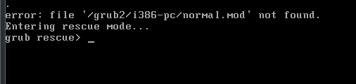

```
# 解决
进入Rescue Mode
```
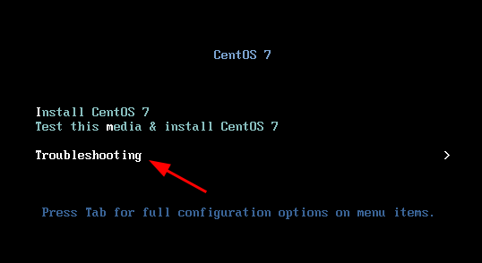

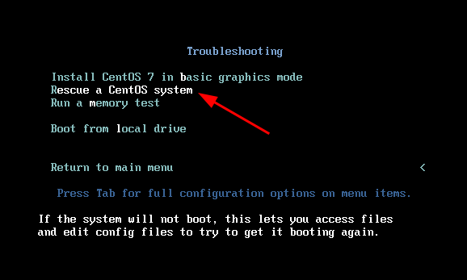
> 如果目标是修复系统而不是取证分析

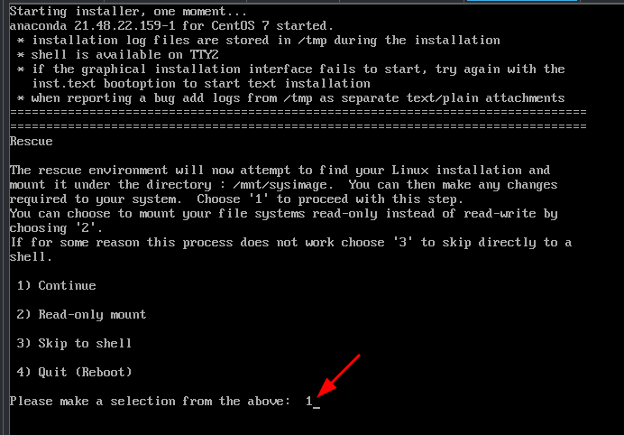

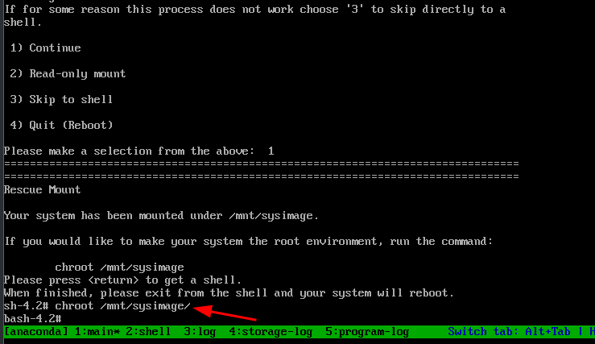

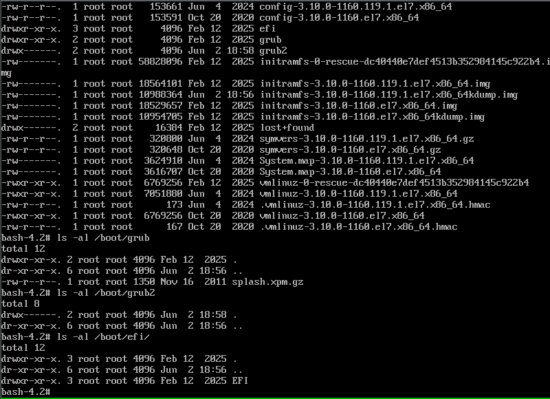


```
这不是 /boot 全部被删除, 而是 /boot/grub2 基本被清空了.

因为/boot下面仍然存在:
vmlinuz-3.10.0-1160.119.1.el7.x86_64
initramfs-3.10.0-1160.119.1.el7.x86_64.img
efi/

说明:
Kernel 存在
Initramfs 存在
EFI分区存在

系统主体没坏. 如果按生产环境划分:
★★★★★ 磁盘损坏
★★★★☆ 文件系统损坏
★★★☆☆ LVM损坏
★★☆☆☆ initramfs损坏
★☆☆☆☆ grub配置丢失          # 当前属于的情况


先确认启动模式
ls /sys/firmware/efi
如果看到 efivars 则说明是UEFI启动
如果提示 No such file or directory 则说明是Legacy BIOS启动
该步骤非常重要, 因为后面命令不同

# 如果是BIOS模式,则：
grub2-install /dev/sda           # 假设系统盘是sda.
grub2-mkconfig -o /boot/grub2/grub.cfg
ls -l /boot/grub2
正常应该出现:
grub.cfg
i386-pc
fonts
locale

然后:
exit
reboot


# 如果是UEFI模式，则:
ls /boot/efi/EFI
一般CentOS7可能是:
centos
BOOT

或者:
redhat
BOOT

然后执行:
grub2-install

再执行:
grub2-mkconfig -o /boot/grub2/grub.cfg

最后:
efibootmgr -v

确认EFI启动项还在.


```

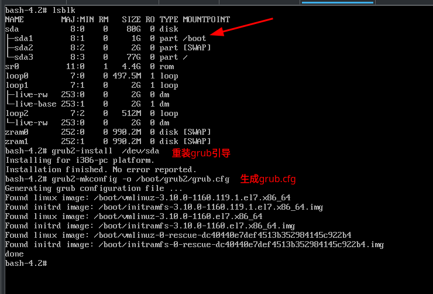

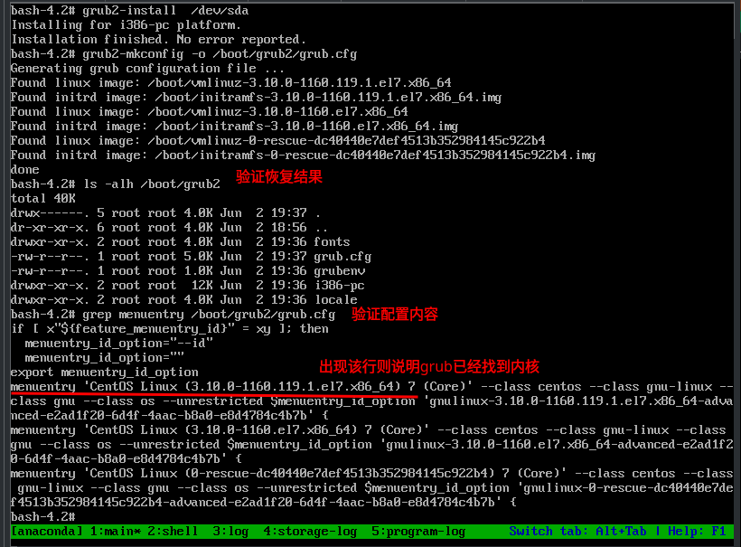

```
退出:
exit
reboot 或 关机把第一启动项设置为从硬盘启动

```
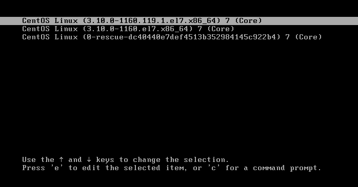

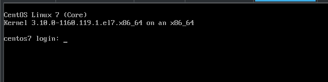


```shell
情况2、如果是:
rm -rf /boot/*

那么:
vmlinuz没了
initramfs没了
grub.cfg没了

这时候不仅仅是GRUB问题.
需要重建整个boot.

```
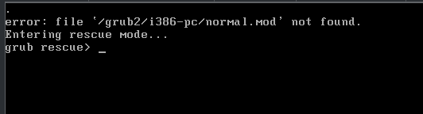

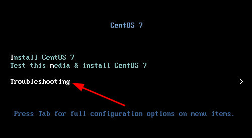

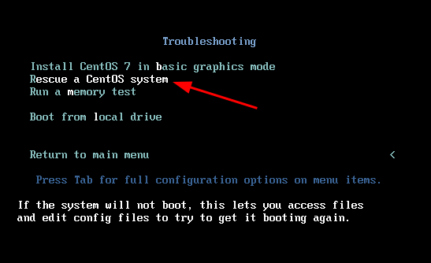

```
如果是情况2
进入:
1) Continue

chroot /mnt/sysimage

先看:
rpm -qa | grep kernel
比如内核还在，说明RPM数据库没坏:
kernel-3.10.0-1160.el7.x86_64

重新安装Kernel包:
yum reinstall kernel kernel-tools kernel-core
```
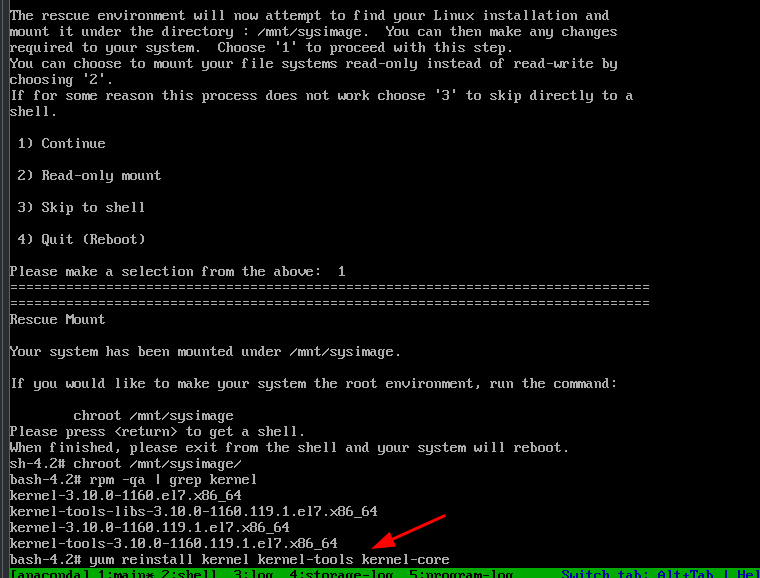

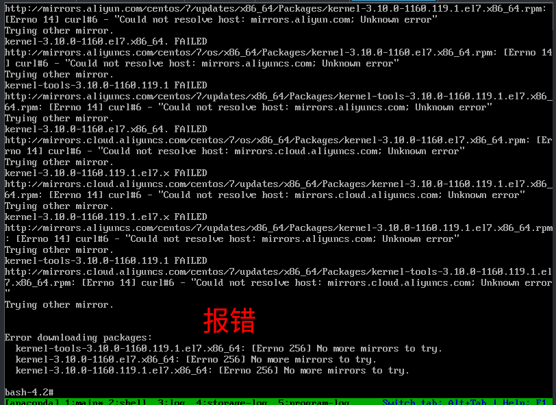

```shell
如果DVD作为源:
yum --disablerepo="*" --enablerepo=c7-media  -y reinstall kernel*
```
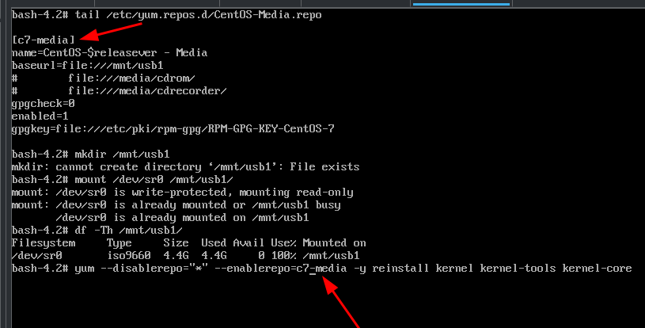

```shell
重建initramfs:dracut -f

# 重建GRUB
BIOS:
grub2-install /dev/sda
grub2-mkconfig -o /boot/grub2/grub.cfg

# ===================================
UEFI:
先确认:
ls /boot/efi/EFI

然后:
grub2-install
grub2-mkconfig -o /boot/grub2/grub.cfg
# ===================================


exit
poweroff        # 然后把第一启动项改成从硬盘启动


如果 grub2-install 报错
比较常见的是:
/usr/lib/grub/i386-pc/modinfo.sh doesn't exist
或者:
grub2-install: error: cannot find a device for /boot

有以上情况则说明以下情况，需要先修RPM包:
grub2-pc包损坏
grub2组件缺失
boot挂载异常


# CentOS 7 DVD进入Rescue后
1) Continue
2) Read-only mount
3) Skip to shell
4) Quit


Continue  自动寻找Linux系统.
通常会看到:
The rescue environment will now attempt to find your Linux installation and mount it under the directory /mnt/sysimage.
然后:
Your system has been mounted under /mnt/sysimage.
此时系统已经帮你完成:

mount /dev/sdaX /mnt/sysimage

后续直接:
chroot /mnt/sysimage

即可开始修复，这是官方推荐方式.


Read-Only Mount  会把系统挂载成只读
例如:
mount -o ro
此时:
grub2-install

可能失败.因为需要写入以下等位置所以不适合GRUB修复，一般用于:数据抢救、取证、查看配置:
/boot
/boot/grub2
MBR
EFI


Skip To Shell   直接给你一个救援Shell.
不会自动挂载系统，需要自己挂载, 普通GRUB修复没必要选:
fdisk -l                  # 找分区
mount /dev/sda2 /mnt      # 自己挂
适用于:
自动挂载失败
LVM异常
RAID异常


Quit
直接重启, 当然没意义

```


## UEFI格式异常启动
```bash
[root@c7efi ~]# ls /boot/
config-3.10.0-1160.119.1.el7.x86_64                      initramfs-3.10.0-1160.el7.x86_64kdump.img
config-3.10.0-1160.el7.x86_64                            symvers-3.10.0-1160.119.1.el7.x86_64.gz
efi                                                      symvers-3.10.0-1160.el7.x86_64.gz
grub                                                     System.map-3.10.0-1160.119.1.el7.x86_64
grub2                                                    System.map-3.10.0-1160.el7.x86_64
initramfs-0-rescue-99a4ab99d0b744bd89939d1385353d46.img  vmlinuz-0-rescue-99a4ab99d0b744bd89939d1385353d46
initramfs-3.10.0-1160.119.1.el7.x86_64.img               vmlinuz-3.10.0-1160.119.1.el7.x86_64
initramfs-3.10.0-1160.119.1.el7.x86_64kdump.img          vmlinuz-3.10.0-1160.el7.x86_64
initramfs-3.10.0-1160.el7.x86_64.img
[root@c7efi ~]# ls /boot/grub2/
grubenv
[root@c7efi ~]# ls /boot/grub2
grubenv
[root@c7efi ~]# ls /boot/grub
splash.xpm.gz
[root@c7efi ~]# ls /boot/efi/
EFI
[root@c7efi ~]# ls /boot/efi/EFI/
BOOT  centos
[root@c7efi ~]# df -Th
文件系统                类型      容量  已用  可用 已用% 挂载点
devtmpfs                devtmpfs  1.9G     0  1.9G    0% /dev
tmpfs                   tmpfs     1.9G     0  1.9G    0% /dev/shm
tmpfs                   tmpfs     1.9G   12M  1.9G    1% /run
tmpfs                   tmpfs     1.9G     0  1.9G    0% /sys/fs/cgroup
/dev/mapper/centos-root xfs        37G  1.8G   36G    5% /
/dev/sda2               xfs      1014M  187M  828M   19% /boot
/dev/sda1               vfat      200M   12M  189M    6% /boot/efi
/dev/mapper/centos-home xfs        19G   33M   18G    1% /home
tmpfs                   tmpfs     378M     0  378M    0% /run/user/0
[root@c7efi ~]# lsblk 
NAME            MAJ:MIN RM  SIZE RO TYPE MOUNTPOINT
sda               8:0    0   60G  0 disk 
├─sda1            8:1    0  200M  0 part /boot/efi
├─sda2            8:2    0    1G  0 part /boot
└─sda3            8:3    0 58.8G  0 part 
  ├─centos-root 253:0    0 36.9G  0 lvm  /
  ├─centos-swap 253:1    0  3.9G  0 lvm  [SWAP]
  └─centos-home 253:2    0   18G  0 lvm  /home
sr0              11:0    1  4.4G  0 rom  


# 终极大招
[root@c7efi ~]# rm -rf /boot/*
rm: 无法删除"/boot/efi": 设备或资源忙
[root@c7efi ~]# ls /boot/
efi


# CentOS 7 DVD进入Rescue后

第一阶段：挂载环境(在chroot之前搞定光盘)
# 1. 激活并挂载系统根分区
lvm vgchange -ay
mount /dev/mapper/centos-root /mnt/sysimage/

# 2. 建立光盘挂载点，必须在 /mnt/sysimage 内部
mkdir -p /mnt/sysimage/mnt/usb1

# 3. 挂载物理设备：先挂载Boot分区，再挂载光盘，最后挂载EFI(这一部分可以已正常挂载了)
mount /dev/sda2 /mnt/sysimage/boot
mount /dev/sr0 /mnt/sysimage/mnt/usb1          # 假设 /dev/sr0 是你的本地光盘
mount /dev/sda1 /mnt/sysimage/boot/efi 

# 4. 绑定系统虚拟文件系统
mount -o bind /dev /mnt/sysimage/dev
mount -o bind /proc /mnt/sysimage/proc
mount -o bind /sys /mnt/sysimage/sys

# 5. 正式进入 chroot
chroot /mnt/sysimage/

第二阶段：在 chroot 环境内恢复内核与配置
# 1. 此时在 chroot 内部，光盘路径在 /mnt/usb1
cd /mnt/usb1/Packages/

# 2. 强制覆盖安装内核（不需要配置 YUM，直接用 rpm 效率最高）
rpm -ivh --force kernel-3.10.0-*.rpm

# 3. 必须验证内核文件是否存在
ls /boot/
# 确认看到 vmlinuz-3.10.0-xxxx 和 initramfs-3.10.0-xxxx.img 

# 重装UEFI引导文件(解决 No compatible bootloader found)
# 不要使用单纯的 grub2-install，直接用 rpm 重新把 EFI 引导链补全
rpm -ivh --force grub2-*.rpm  shim-x64-*.rpm

# 4. 恢复 GRUB2 引导配置
mkdir -p /boot/grub2
grub2-editenv /boot/grub2/grubenv create
mkdir -p /boot/efi/EFI/centos/
grub2-mkconfig -o /boot/efi/EFI/centos/grub.cfg
注意：执行完最后一步，命令行必须输出 Found linux image... 且没有报错才算成功

# 5. 退出 chroot
exit

第三阶段：干净卸载（彻底断绝 reboot 爆红）
注意：退出来之后，当前的 Shell 路径绝对不能处于 /mnt/sysimage 及其子目录下！先切回安全路径：
cd /

# 严格按照由深到浅的顺序卸载，不要无故加 -l 参数
umount  /mnt/sysimage/boot/efi
umount  /mnt/sysimage/mnt/usb1        # 干净卸载光盘
umount  /mnt/sysimage/boot

umount  /mnt/sysimage/dev
umount  /mnt/sysimage/proc
umount  /mnt/sysimage/sys

# 最后才能卸载根目录本身
umount /mnt/sysimage

# 数据落盘，安全重启
sync
reboot   # 或poweroff关机，把光盘设置成第一启动项后再开机

```


---

# 三、Rocky8修复方式

## BIOS格式异常启动
```bash
[root@c8 ~]# rm -rf  /boot/*
[root@c8 ~]# reboot

```
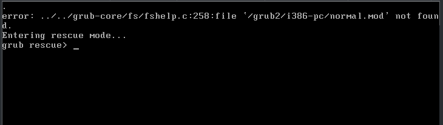

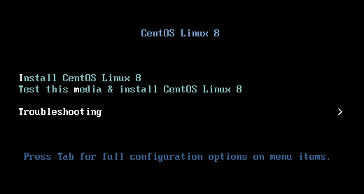

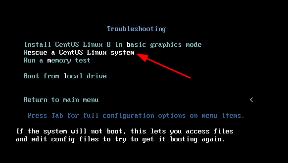

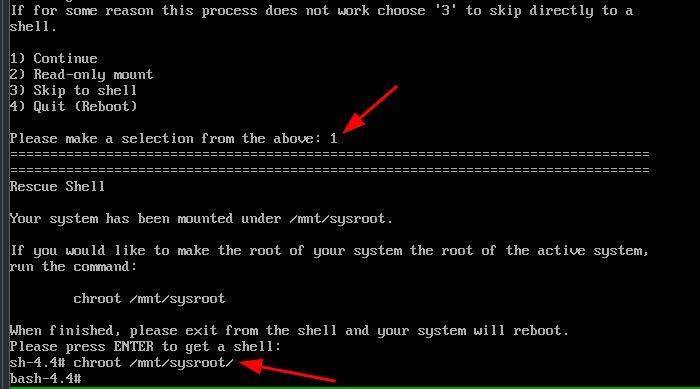

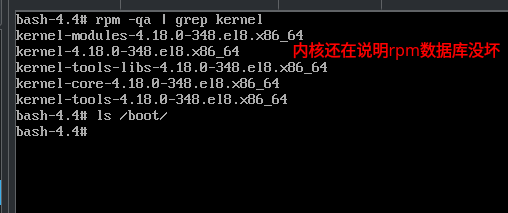

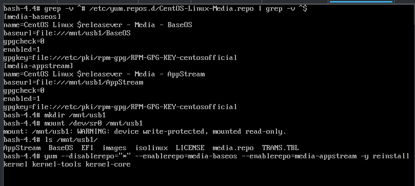

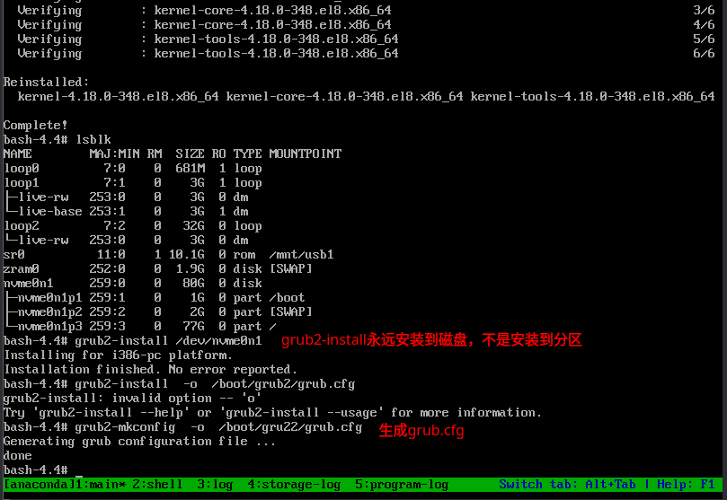

```
流程基本相同:
grub2-install /dev/nvme0n1        # grub2-install 永远安装到磁盘, 不是安装到分区

然后:
grub2-mkconfig -o /boot/grub2/grub.cfg

exit
poweroff               # 更换第一启动项

```
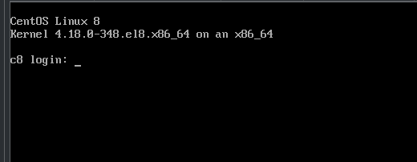


---

## UEFI格式异常启动
```shell
[root@rocky8efi ~]# lsblk -f
NAME        FSTYPE      LABEL                UUID                                   MOUNTPOINT
sda                                                                                 
|-sda1      vfat                             F8C6-E325                              /boot/efi
|-sda2      LVM2_member                      WEdDEt-LvP2-eDod-K3Rb-GB1o-upfn-o1sAJY 
| |-rl-root xfs                              585450b3-bd50-4d76-8a79-060737705398   /
| `-rl-swap swap                             32fa2921-eb5d-49b3-8fb2-6e3122d0e244   [SWAP]
`-sda3      ext4                             488b8278-5586-4206-b133-a7ba72fd63a8   /boot
sr0         iso9660     Rocky-8-5-x86_64-dvd 2021-11-14-09-31-13-00  

[root@rocky8efi ~]# df -Th | grep "^/dev"
/dev/mapper/rl-root xfs        54G  3.4G   51G   7% /
/dev/sda3           ext4      1.5G  240M  1.1G  18% /boot
/dev/sda1           vfat      599M  5.9M  594M   1% /boot/efi


[root@rocky8efi ~]# ls /boot/
System.map-4.18.0-348.el8.0.2.x86_64                     initramfs-4.18.0-553.126.1.el8_10.x86_64.img
System.map-4.18.0-553.126.1.el8_10.x86_64                initramfs-4.18.0-553.126.1.el8_10.x86_64kdump.img
config-4.18.0-348.el8.0.2.x86_64                         loader
config-4.18.0-553.126.1.el8_10.x86_64                    lost+found
efi                                                      symvers-4.18.0-348.el8.0.2.x86_64.gz
grub2                                                    symvers-4.18.0-553.126.1.el8_10.x86_64.gz
initramfs-0-rescue-31029e4369074aeaae78595f092bdd19.img  vmlinuz-0-rescue-31029e4369074aeaae78595f092bdd19
initramfs-4.18.0-348.el8.0.2.x86_64.img                  vmlinuz-4.18.0-348.el8.0.2.x86_64
initramfs-4.18.0-348.el8.0.2.x86_64kdump.img             vmlinuz-4.18.0-553.126.1.el8_10.x86_64
[root@rocky8efi ~]# ls /boot/grub2/
grubenv
[root@rocky8efi ~]# ls /boot/efi/
EFI
[root@rocky8efi ~]# ls /boot/efi/EFI/
BOOT  rocky
[root@rocky8efi ~]# ls /boot/efi/EFI/rocky/
BOOTX64.CSV  fonts  grub.cfg  grubenv  grubx64.efi  mmx64.efi  shimx64-rocky.efi  shimx64.efi


[root@rocky8efi ~]# rm -rf /boot/*


Rocky8进入Rescue恢复流程
选择1 continue


激活LVM:
vgchange -ay

# 查看分区
lsblk -f


挂载:
mount /dev/mapper/rl-root  /mnt
mount /dev/sda2  /mnt/boot
mount /dev/sda1  /mnt/boot/efi

chroot:
mount --bind /dev /mnt/dev
mount --bind /proc /mnt/proc
mount --bind /sys /mnt/sys

chroot /mnt
```
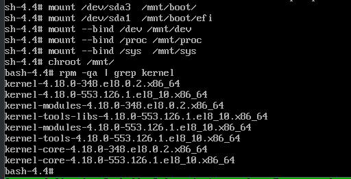
```shell
重装内核
dnf -y reinstall kernel-*

如果仓库不可用:
/etc/yum.repos.d/中只剩下本地的repo文件
mount /dev/sr0 /mnt/usb1
rpm -ivh /mnt/cdrom/BaseOS/Packages/kernel-*


Rocky8重建initramfs
dracut -f


重建grub
mkdir -p /boot/grub2                           # 创建目录
grub2-editenv /boot/grub2/grubenv create       # 创建环境文件
grub2-mkconfig -o /boot/grub2/grub.cfg         # 生成配置


UEFI机器需再同步EFI配置:
mkdir /boot/efi/EFI/rocky/
grub2-mkconfig -o /boot/efi/EFI/rocky/grub.cfg

如果EFI文件也丢失
ls /boot/efi/EFI/rocky           # 现在该目录下只有grub.cfg，因为所有都丢失了

如果以下2个文件也丢失:
grubx64.efi
shimx64.efi

安装:
cd /mnt/usb1/BaseOS/Packages
rpm -ivh --nodeps --force  g/grub2-*
rpm -ivh --nodeps --force  shim-x64-*


先检查 EFI 文件是否存在:
ls -R /boot/efi/EFI/rocky/        # 重点看该项
shimx64.efi
grubx64.efi
grub.cfg
如果EFI文件还在则通常只需要:
grub2-editenv /boot/grub2/grubenv create

grub2-mkconfig -o /boot/grub2/grub.cfg

然后:
cp -a /boot/grub2/grub.cfg  /boot/efi/EFI/rocky/grub.cfg
或者:
grub2-mkconfig -o /boot/efi/EFI/rocky/grub.cfg

# =========================================
如果EFI文件没了
不要执行grub2-install

而是:
dnf reinstall shim-x64 grub2-efi-x64 grub2-efi-x64-modules

安装包会自动恢复:
shimx64.efi
grubx64.efi

然后:
grub2-mkconfig -o /boot/grub2/grub.cfg
# =========================================


再检查NVRAM
efibootmgr -v

正常应该有类似:
Boot0000* Rocky

如果没有:
efibootmgr \
-c \
-d /dev/sda \
-p 1 \
-L Rocky \
-l '\EFI\rocky\shimx64.efi'


不过在重启前, 我建议做最后三个检查:
ls -l /mnt/boot

确认以下文件已经存在:
vmlinuz-*
initramfs-*


ls -l /mnt/boot/efi/EFI/rocky
确认以下文件存在:
shimx64.efi
grubx64.efi
grub.cfg


确认配置文件不是空文件
cat /mnt/boot/efi/EFI/rocky/grub.cfg | head
或者:
cat /mnt/boot/grub2/grub.cfg | head


退出chroot
然后卸载绑定挂载:
umount /mnt/dev
umount /mnt/proc
umount /mnt/sys       # 有可能需要加-l

再卸载 EFI 和 boot:
umount /mnt/boot/efi
umount /mnt/boot

umount /mnt           # 有可能需要加-l


```


---

# 四、Rocky9修复方式
```shell
Rocky 9与8类似, 但更依赖:
BLS
dracut
EFI


# 检查BLS
ls /boot/loader/entries/
abcd123.conf
efgh456.conf


如果这里为空,GRUB正常,Kernel无法启动的情况非常常见.


# 重建BLS

重新生成内核条目:
kernel-install  add  $(uname -r)  /lib/modules/$(uname -r)/vmlinuz


# 重建GRUB
grub2-install

然后:
grub2-mkconfig -o /boot/grub2/grub.cfg

```


## BIOS格式异常启动
```shell
[root@rocky9 ~]# lsblk 
NAME        MAJ:MIN RM  SIZE RO TYPE MOUNTPOINTS
sr0          11:0    1 10.7G  0 rom  
nvme0n1     259:0    0  100G  0 disk 
├─nvme0n1p1 259:1    0    1G  0 part /boot
├─nvme0n1p2 259:2    0    2G  0 part [SWAP]
└─nvme0n1p3 259:3    0   97G  0 part /
[root@rocky9 ~]# ls /boot/
config-5.14.0-503.14.1.el9_5.x86_64                      loader
config-5.14.0-503.23.2.el9_5.x86_64                      lost+found
efi                                                      symvers-5.14.0-503.14.1.el9_5.x86_64.gz
grub2                                                    symvers-5.14.0-503.23.2.el9_5.x86_64.gz
initramfs-0-rescue-dd41710cfd1045598c4b7c0acfb2992e.img  System.map-5.14.0-503.14.1.el9_5.x86_64
initramfs-5.14.0-503.14.1.el9_5.x86_64.img               System.map-5.14.0-503.23.2.el9_5.x86_64
initramfs-5.14.0-503.14.1.el9_5.x86_64kdump.img          vmlinuz-0-rescue-dd41710cfd1045598c4b7c0acfb2992e
initramfs-5.14.0-503.23.2.el9_5.x86_64.img               vmlinuz-5.14.0-503.14.1.el9_5.x86_64
initramfs-5.14.0-503.23.2.el9_5.x86_64kdump.img          vmlinuz-5.14.0-503.23.2.el9_5.x86_64
[root@rocky9 ~]# ls /boot/efi/
EFI
[root@rocky9 ~]# ls /boot/efi/EFI/
rocky
[root@rocky9 ~]# ls /boot/efi/EFI/rocky/
[root@rocky9 ~]# ls /boot/grub2/
device.map  fonts  grub.cfg  grubenv  i386-pc  locale
[root@rocky9 ~]# rm -rf /boot/*
[root@rocky9 ~]# reboot


系统启动链路:

UEFI
 ↓
EFI/rocky/shimx64.efi
 ↓
grubx64.efi
 ↓
grub.cfg
 ↓
vmlinuz
 ↓
initramfs
 ↓
root=/dev/nvme0n1p3
 ↓
systemd

当前删掉的是启动链路, 不是操作系统本身.
所以恢复目标只有两个:
重新安装 kernel
重新生成 grub

```
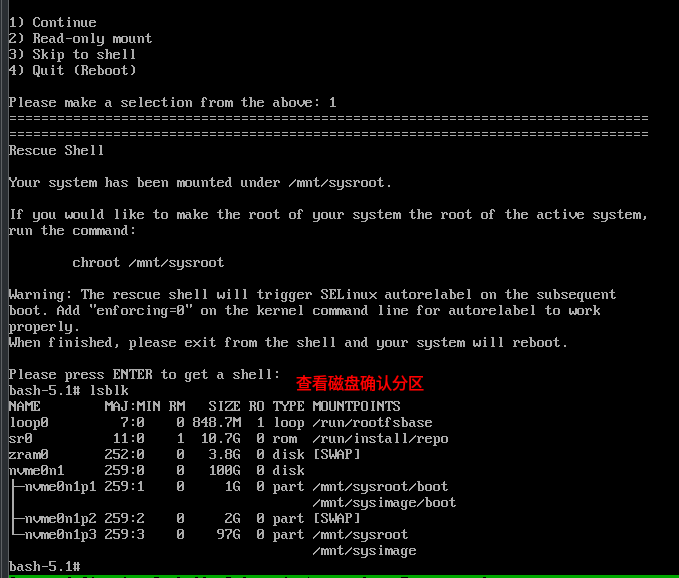
```shell
已自动挂载:
mount /dev/nvme0n1p3 /mnt/sysroot
mount /dev/nvme0n1p1 /mnt/sysroot/boot

# chroot
chroot /mnt/sysroot

dnf repolist

# ====================================================================
# 如网络不通则自行挂光盘
cat >/etc/yum.repos.d/iso.repo <<EOF
[BaseOS]
name=BaseOS
baseurl=file:///mnt/BaseOS
enabled=1
gpgcheck=0

[AppStream]
name=AppStream
baseurl=file:///mnt/AppStream
enabled=1
gpgcheck=0
EOF

再:
dnf clean all
dnf repolist

# ====================================================================

dnf install kernel kernel-core kernel-modules
ls /boot/          # 此时该目录下会有部分恢复回来，会看到比如以下的部分
vmlinuz-5.14.x
initramfs-5.14.x.img
System.map
config


# 重建initramfs, 保险起见:
dracut --force --regenerate-all


BIOS模式还需要:
grub2-install /dev/nvme0n1              # 是nvme0n1不是/dev/nvme0n1p1或1p3

Rocky9生成 grub.cfg
mkdir /boot/grub2
grub2-mkconfig -o /boot/grub2/grub.cfg


检查,应该看到内核菜单:
cat /boot/grub2/grub.cfg | grep menuentry


退出重启
exit
poweroff          # 把硬盘启动作为第一启动项


```
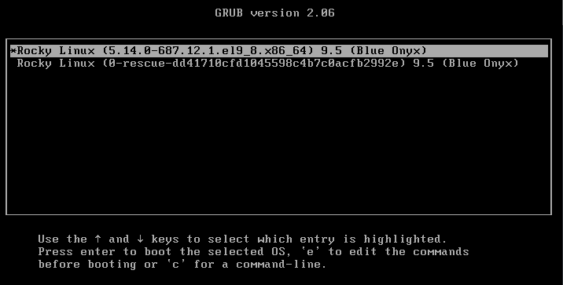

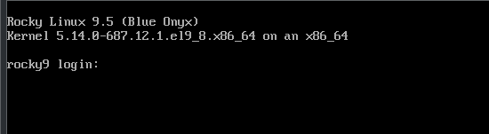


## UEFI格式异常启动
```shell
[root@rocky9 ~]# lsblk -f
NAME        FSTYPE  FSVER    LABEL                UUID                                   FSAVAIL FSUSE% MOUNTPOINTS
sr0         iso9660 Joliet E Rocky-9-5-x86_64-dvd 2024-11-16-01-52-31-00                                
nvme0n1                                                                                                 
├─nvme0n1p1 vfat    FAT32                         5629-C80C                               591.2M     1% /boot/efi
├─nvme0n1p2 xfs                                   ba593433-e950-4258-b7e6-9d8da29023d0      1.1G    23% /boot
└─nvme0n1p3 LVM2_me LVM2 001                      pMu7pf-Cl9u-7BJ0-k4LH-4jgH-zVzv-qNfmUc                
  ├─rl-root xfs                                   efe61f6b-bfae-4ee4-9469-a1fe7eb31e32     51.6G     4% /
  └─rl-swap swap    1                             11c6b0cb-c9bd-4356-94e7-a122d4d9a34e                  [SWAP]
[root@rocky9 ~]# ls /boot/
config-5.14.0-503.14.1.el9_5.x86_64                      loader
config-5.14.0-687.12.1.el9_8.x86_64                      symvers-5.14.0-503.14.1.el9_5.x86_64.gz
efi                                                      symvers-5.14.0-687.12.1.el9_8.x86_64.gz
grub2                                                    System.map-5.14.0-503.14.1.el9_5.x86_64
initramfs-0-rescue-fc24943783f34f32a493a164d38ca780.img  System.map-5.14.0-687.12.1.el9_8.x86_64
initramfs-5.14.0-503.14.1.el9_5.x86_64.img               vmlinuz-0-rescue-fc24943783f34f32a493a164d38ca780
initramfs-5.14.0-503.14.1.el9_5.x86_64kdump.img          vmlinuz-5.14.0-503.14.1.el9_5.x86_64
initramfs-5.14.0-687.12.1.el9_8.x86_64.img               vmlinuz-5.14.0-687.12.1.el9_8.x86_64
initramfs-5.14.0-687.12.1.el9_8.x86_64kdump.img

[root@rocky9 ~]# ls /boot/grub2/
fonts  grub.cfg  grubenv
[root@rocky9 ~]# ls /boot/efi/
EFI
[root@rocky9 ~]# ls /boot/efi/EFI/
BOOT  rocky
[root@rocky9 ~]# ls /boot/efi/EFI/rocky/
BOOTX64.CSV  grub.cfg  grubx64.efi  mmx64.efi  shim.efi  shimx64.efi  shimx64-rocky.efi


[root@rocky9 ~]# rm -rf /boot/*
rm: 无法删除 '/boot/efi': 设备或资源忙
[root@rocky9 ~]# init 0


# 挂载光盘，进入Rescue Mode
按1进去


第一阶段：挂载真实环境(chroot准备)
EL9的卷组名称默认叫rl。由于是NVMe固件，分区名称为p1、p2、p3
# 激活LVM卷组
lvm vgchange -ay

# 挂载根分区到救援目录
mount /dev/mapper/rl-root /mnt/sysroot

# 创建光盘挂载点（必须在真实根分区的内部）
mkdir -p /mnt/sysroot/mnt/usb1


systemctl daemon-reload


# 4. 严格按照依赖层级挂载物理设备(先挂Boot，再挂光盘，最后挂EFI,这一步好像自动做了)
mount /dev/nvme0n1p2  /mnt/sysroot/boot
mount /dev/sr0  /mnt/sysroot/mnt/usb1
mount /dev/nvme0n1p1  /mnt/sysroot/boot/efi

# 5. 绑定系统虚拟文件系统（必须全绑，EL9恢复内核和内核模块强依赖这些虚拟文件系统）
mount -o bind /dev /mnt/sysroot/dev
mount -o bind /proc /mnt/sysroot/proc
mount -o bind /sys /mnt/sysroot/sys
mount -o bind /sys/firmware/efi/efivars    /mnt/sysroot/sys/firmware/efi/

# 6. 切换到真实系统环境
chroot /mnt/sysroot/


第二阶段：在chroot内部重建内核与UEFI引导链
此时你已经进入了Rocky 9的真实环境，光盘目录在/mnt/usb1/
# 进入光盘安装包目录
cd /mnt/usb1/BaseOS/Packages/

# 初始化 GRUB2 基本配置环境
mkdir -p /boot/grub2
grub2-editenv /boot/grub2/grubenv create
mkdir -p /boot/efi/EFI/rocky/

# 强制重装 Rocky 9 的内核（会自动重新生成内核核心文件和引导 initramfs）
rpm -ivh --force --nodeps  k/kernel-*.rpm

# 强行补全 Rocky 9 的 UEFI 引导文件链
rpm -ivh --force --nodeps  g/grub2-*.rpm  s/shim-x64-*.rpm


# 核心区别：修复 EL9 独有的 BLS 引导菜单配置
# 因为 rm -rf 把 /boot/loader 目录删了，即使重装了内核，GRUB 也找不到菜单项。
# 我们需要调用 EL9 自带的内核工具，为当前安装的内核强行生成 BLS 项：
kernel-install add $(uname -r) /boot/vmlinuz-$(uname -r)
# 或者如果 uname -r 是救援系统的内核，直接指定刚刚装进去的Rocky9实际内核版本号(例如)：
# kernel-install add 5.14.0-503.14.1.el9_5.x86_64 /boot/vmlinuz-5.14.0-503.14.1.el9_5.x86_64

# 生成最终的 UEFI 引导菜单
grub2-mkconfig -o /boot/grub2/grub.cfg
注:
从RHEL9开始，为了统一 Legacy BIOS 和 UEFI 两种模式的维护体验，红帽官方引入了 GRUB Wrapper(引导包装器)机制
在UEFI模式下，/boot/efi/EFI/rocky/grub.cfg不再是那个包含几百行内核参数的"大文件"，它现在变成了一个只有几行代码的固定转发脚本(Wrapper)，其作用是强行将引导流量重定向到 /boot/grub2/grub.cfg


# 退出 chroot
exit


第三阶段：优雅卸载与安全重启
退出来之后，确保当前的 Shell 路径不在 /mnt/sysimage 的子目录下，防止内核死锁挂载：
# 1. 切回安全路径
cd /

# 2. 严格按由深到浅的顺序解挂
umount /mnt/sysroot/boot/efi
umount /mnt/sysroot/mnt/usb1
umount /mnt/sysroot/boot

umount /mnt/sysroot/dev
umount /mnt/sysroot/proc
umount /mnt/sysroot/sys

# 3. 卸载根目录本身
umount /mnt/root

# 4. 数据完全落盘
sync

# 5. 重启
reboot           # 或poweroff关机后重新把硬盘设置成第一启动项


问题：
默认项会在第二行，底层技术原因：
在执行修复时，你使用了 rpm -ivh --force --nodeps kernel-*.rpm 这一条命令把光盘里所有的内核包一股脑强行灌了进去
在Rocky9的官方光盘中，除了标准内核包(kernel-core)，还包含了一个用于内核开发调试的 kernel-debug-core 包

由于kernel-debug 在字母排序或 BLS 菜单初始化时被排在了前面，导致它占用了第一项(Index 0)。但是，系统在自动配置默认启动项时，识别到第二项才是真正的标准生产内核，为了保证服务器的运行性能(debug内核会严重拖慢生产系统)，它非常智能地把默认指针 saved_entry 指向了第二项(Index 1)

也就是说，停在第二项才是完全正确的。如果停在第一项debug内核里，服务器性能会大打折扣

```
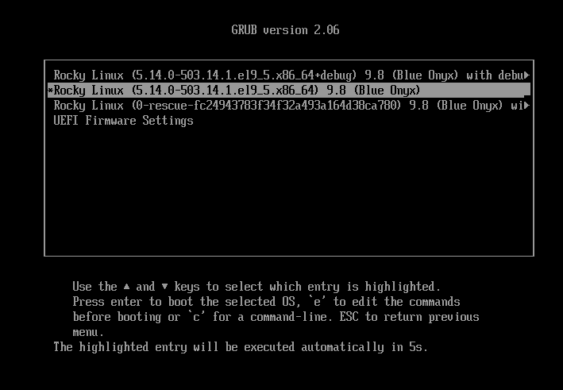

```shell
直接卸载debug内核(最彻底、最干净)
# 查找系统里安装的 debug 内核组件
rpm -qa | grep kernel | grep debug

# 直接用 dnf/rpm 将其卸载(卸载后BLS会自动清理对应的菜单项)
dnf -y remove kernel-debug-core kernel-debug-modules

# 重新生成一次 GRUB 菜单以刷新缓存
grub2-mkconfig -o /boot/grub2/grub.cfg

reboot

```
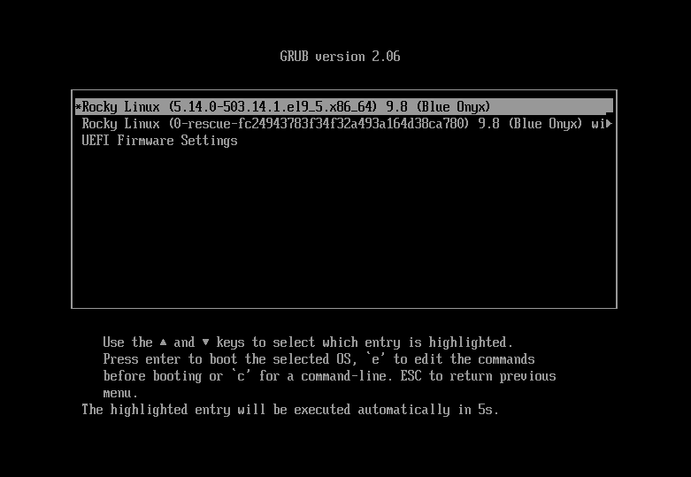


---

# 五、生产环境最常见的4种GRUB故障
```shell
# 故障1 提示: grub rescue>
原因是grub.cfg丢失
修复:
grub2-mkconfig


# 故障2 提示: no such partition
原因:
磁盘扩容
LVM调整
分区UUID变化

修复:
blkid
重新生成:
grub2-mkconfig


---

## 故障3
提示: Kernel Panic
原因: initramfs损坏

修复:
dracut -f

不要先折腾GRUB. 很多工程师在这里误判

---

## 故障4
提示: Boot Device Not Found
原因: EFI文件丢失
修复: grub2-install
重新写EFI启动项.

```


# 六、接单时真正高频的场景
```shell
实际Upwork/Fiverr中. 客户极少主动说GRUB坏了

通常描述是: Server won't boot
或者:
After reboot server stuck

真正高频来源:
1. VMware迁移后无法启动
2. Proxmox迁移后无法启动
3. 磁盘扩容后无法启动
4. 修改fstab后无法启动
5. 内核升级后无法启动
6. 删除旧内核误删GRUB文件

其中:
VMware → Proxmox

迁移导致的启动故障占比非常高.

```


# 七、面试级排查思路
```shell
永远不要先执行: grub2-install

先确认:
fdisk -l
blkid
lsblk


判断:
磁盘是否存在
分区是否存在
EFI是否存在
boot是否存在
Kernel是否存在
initramfs是否存在


如果磁盘本身已经损坏 还 继续修GRUB没有意义.

---

# 最终记忆口诀
GRUB报错 先看分区
分区正常看boot
boot正常看kernel
kernel正常看initramfs
initramfs正常再重建GRUB

不要上来就grub2-install

```


# initramfs故障
```shell


```


# ext4/xfs修复
```shell


```


# mdadm阵列恢复
```shell


```


# LVM恢复
```shell


```


# ssh失联
```shell


```


# nginx崩溃
```shell


```


# mysql启动失败
```shell


```